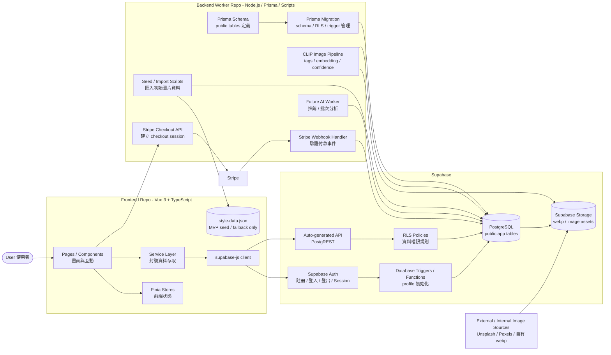
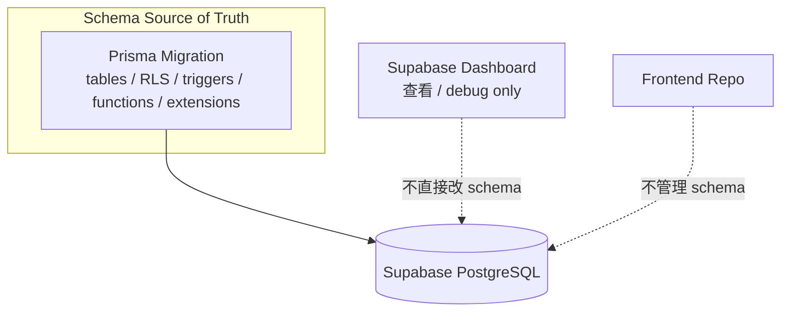
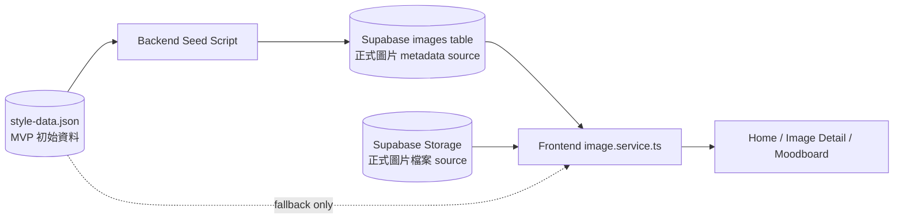
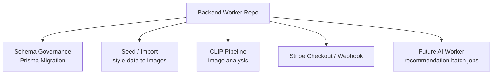

# Asterism 後端架構規劃

> 本文件是「規劃中的目標架構」，不是目前 repo 已完整落地的真實架構。用途是統一後續開發方向、責任邊界與資料來源原則。
> 
> 文件版本：v1.0.0 | 最後更新日期：2026-06-24 

一句話摘要：Asterism 採用 **Supabase-first + Backend Worker Repo**。前端專注 UI 與互動，Supabase 負責 Auth、資料存取與權限，Backend Repo 負責 schema 治理、批次任務、AI pipeline 與金流 webhook。

本文只描述：

- 後端架構方向與職責分層
- 單一資料來源原則
- Backend Repo 的合理邊界
- 建議開發順序

功能流程圖請見：[Asterism 後端功能流程規劃](./asterism-backend-flows.md)

---

## 1. 架構總結

Asterism 的後端規劃不是傳統「所有資料都必須打 Express API」的模式，而是：

```text
Frontend
→ Supabase Auth / Auto API / Storage / RLS
→ PostgreSQL

Backend Worker Repo
→ Prisma Migration / seed / CLIP / Stripe webhook
→ PostgreSQL
```

這代表：

- 一般使用者資料讀寫優先走 Supabase + RLS。
- 需要 secret、批次任務、資料治理或第三方 webhook 的流程才交給 Backend Repo。
- Frontend 不直接管理 schema。
- Backend Repo 不膨脹成所有 CRUD 的中轉站。

---

## 2. 核心分工

| 區塊 | 主要職責 | 不負責的事 |
|---|---|---|
| Frontend Repo | Vue UI、Pinia 狀態、service layer、supabase-js 呼叫 | 不管理 schema、不處理金流密鑰、不跑 CLIP pipeline |
| Supabase | Auth、PostgreSQL、Auto API、RLS、Storage、Trigger / Function | 不作為手動亂改 schema 的主要入口 |
| Backend Worker Repo | Prisma Migration、seed、CLIP pipeline、Stripe checkout / webhook、未來 AI worker | 不取代所有前端資料讀寫 |
| Prisma Migration | 控制資料庫變更，包含 table、column、relation、index，以及必要的 RLS、trigger、function、extension | 不靠 Dashboard 手動改 schema |

---

## 3. 後端架構總圖



---

## 4. 架構原則

### 4.1 Frontend 只透過 service layer 存取資料

前端 component 不應到處直接寫 Supabase query。建議統一：

```text
Page / Component
→ service layer
→ supabase-js / backend API
→ Supabase / Backend Repo
```

這樣 UI 不會綁死資料來源。未來從 `style-data.json` 改成 Supabase `images` table 時，只改 `image.service.ts`，不用把整個前端挖開重接電線。

### 4.2 Supabase 是主要 runtime backend

以下 runtime 功能優先直接走 Supabase：

- 註冊、登入、登出、session
- 讀取 / 更新 profile
- 保存 Style DNA 結果
- 讀取圖片 metadata
- Moodboard 收藏
- 讀取自己的 Moodboard
- Storage 圖片資源

### 4.3 Backend Worker Repo 是治理與背景任務中心

Backend Repo 負責不能放前端、也不適合直接交給 Supabase client 的事情：

- Prisma Migration：table、column、relation、index、RLS、trigger、function、extension
- seed / import scripts
- CLIP image pipeline
- Stripe checkout API
- Stripe webhook handler
- future AI worker / recommendation batch job

### 4.4 Supabase Dashboard 只用來查看與 debug

Dashboard 可以：

- 看資料
- debug query
- 檢查 Auth / Storage
- 確認 RLS 是否生效

Dashboard 不應該成為主要 schema 修改來源。

---

## 5. 單一資料來源原則

### 5.1 Schema 的單一來源



規則：

| 類型 | 單一來源 |
|---|---|
| public app tables | Prisma Migration |
| RLS policies | Prisma Migration |
| triggers / functions | Prisma Migration |
| extensions，例如 pgvector | Prisma Migration |
| production schema 修改 | Prisma Migration，不是 Dashboard 手動操作 |

### 5.2 圖片資料的單一來源

圖片資料規劃會經歷兩個階段：



規則：

| 階段 | 圖片 metadata 來源 | 說明 |
|---|---|---|
| MVP 過渡期 | `style-data.json` | 可作為 demo fallback |
| 正式資料階段 | Supabase `images` table | app 的主要圖片 metadata source |
| 圖片檔案 | Supabase Storage 或 public image path | DB 只存 metadata / path / URL |
| CLIP 結果 | Supabase `images` table | 由 Backend CLIP pipeline 寫入 |

正式階段不要讓前端 JSON 和 Supabase `images` table 長期雙主資料源，會變得難以追蹤錯誤與維護。

---

## 6. Backend Repo 的合理邊界

### 6.1 Backend Repo 應該負責



### 6.2 Backend Repo 不應該負責

| 不應負責 | 原因 |
|---|---|
| 一般登入 / 登出 API | Supabase Auth 已經處理 |
| 每一個普通 CRUD API | Supabase Auto API + RLS 已足夠 |
| UI 狀態管理 | 這是前端職責 |
| 直接存放圖片二進位內容到 DB | 應交給 Storage，DB 存 path / metadata |
| 手動覆蓋 Supabase Dashboard 設定 | schema 應由 migration 追蹤 |

---

## 7. 規劃階段標註

這份文件描述目標架構，因此功能應用以下狀態標註：

| 狀態 | 說明 |
|---|---|
| Current | repo 已有基礎或正在落地 |
| Planned | 已納入近期規劃，但尚未完整實作 |
| Future | 方向合理，但不應阻塞目前 MVP |

建議目前這樣標：

| 功能 | 規劃狀態 |
|---|---|
| Express health check / 基礎 server | Current |
| Prisma app tables | Current |
| Prisma Migration for RLS / trigger | Current / Planned |
| Supabase Auth 接入 | Planned |
| Profile / Style DNA 保存 | Planned |
| Moodboard 收藏 | Planned |
| Image seed / CLIP pipeline | Current / Planned |
| Supabase Storage 正式資產管理 | Planned |
| Stripe checkout / webhook | Future |
| AI recommendation worker | Future |

---

## 8. 最終責任分工表

| 功能 | Frontend | Supabase | Backend Repo |
|---|---|---|---|
| 註冊 / 登入 / 登出 | 呼叫 `auth.service.ts` | Auth / Session | 不需要接管 |
| Email 驗證 | 顯示狀態與導頁 | Auth email confirmation | 不需要接管 |
| Profile 初始化 | 顯示 / 讀取 profile | Trigger 建立 profile | Prisma Migration 管 trigger |
| Style DNA 保存 | 呼叫 `profile.service.ts` | profiles + RLS | Prisma 管 schema |
| Style DNA 重新讀取 | hydrate Pinia store | profiles + RLS | 不需要 runtime API |
| Moodboard 收藏 | 呼叫 `moodboard.service.ts` | moodboard_folders / moodboard_items + RLS | Prisma Migration |
| 圖片顯示 | 呼叫 `image.service.ts` | images + Storage | seed / CLIP 更新資料 |
| CLIP 標註 | 顯示結果 | 儲存 tags / confidence | Pipeline 寫入 |
| 金流 checkout | 呼叫後端 checkout API | 儲存付款結果 | 建立 Stripe session |
| 金流 webhook | 不處理 | 儲存付款狀態 | 驗證 webhook 並更新 DB |
| Schema migration | 不處理 | 執行結果 | Prisma Migration |

---

## 9. 檢查清單

### 關注點分離檢查

- [ ] Component 不直接散落 Supabase query
- [ ] Supabase 存取集中在 service layer
- [ ] Auth 使用 Supabase Auth，不自造登入系統
- [ ] 一般 CRUD 走 Supabase Auto API + RLS
- [ ] 金流建立與 webhook 走 Backend Repo
- [ ] CLIP / seed / AI 批次任務走 Backend Repo
- [ ] schema 修改走 Prisma Migration，不靠 Dashboard 手動改

### 單一資料來源檢查

- [ ] public app table schema 以 Prisma Migration 為主
- [ ] RLS / trigger / function 以 Prisma Migration 為主
- [ ] Style DNA 結果以 Supabase `profiles` 為準
- [ ] Moodboard 收藏以 Supabase `moodboard_items` 為準
- [ ] 正式圖片 metadata 以 Supabase `images` table 為準
- [ ] 圖片檔案以 Storage / public image path 為準
- [ ] Pinia 只作為 runtime cache，不當永久資料來源
- [ ] `style-data.json` 只作 seed / fallback，不長期作正式主資料源

---

## 10. 建議開發順序

```text
Phase 1：確認 Supabase Auth + profiles trigger
Phase 2：確認 RLS policies 可正確限制 profile / moodboard 資料
Phase 3：將 style-data.json seed 到 images table
Phase 4：前端 image.service.ts 改成 Supabase 優先，JSON fallback
Phase 5：串接 Style DNA result 保存 / 讀取
Phase 6：串接 Moodboard 收藏與讀取
Phase 7：加入 CLIP pipeline 與 review status
Phase 8：加入 Stripe checkout + webhook
```
