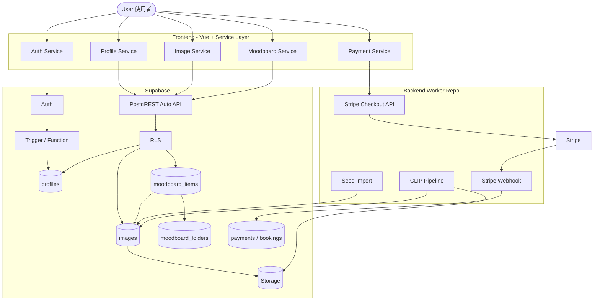
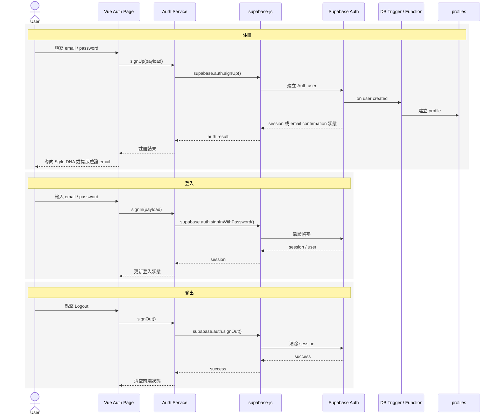
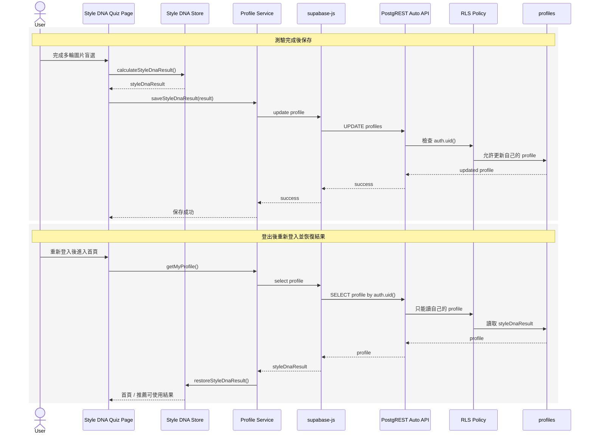
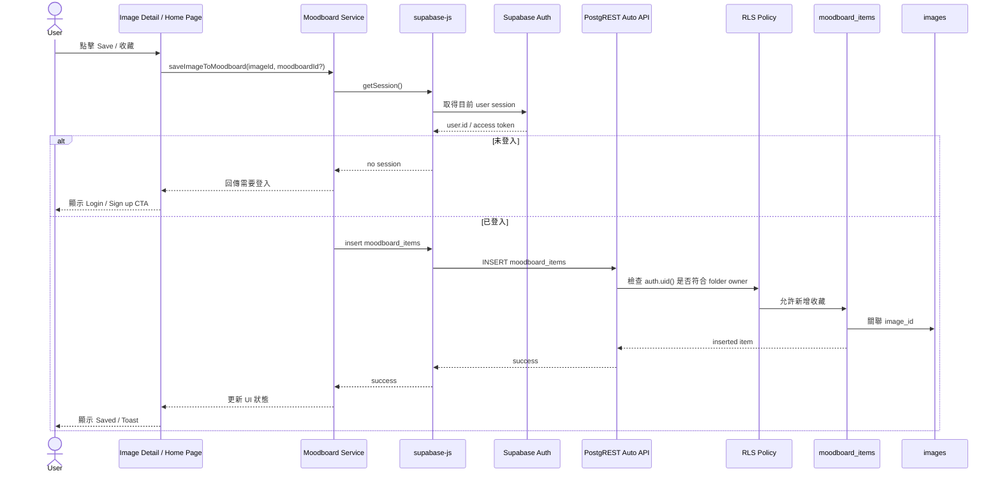
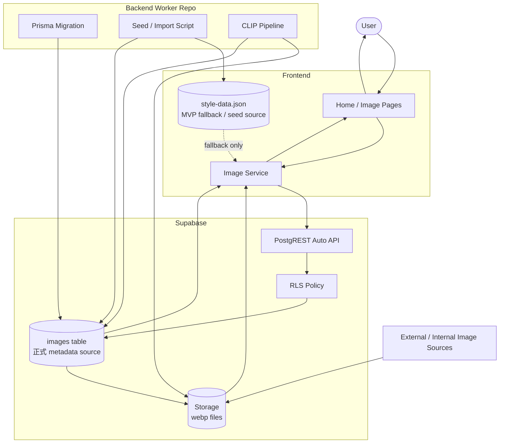
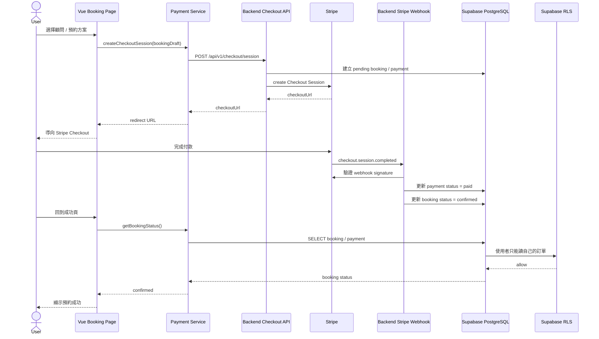

# Asterism 後端功能流程規劃

> 本文件是「規劃中的功能流程圖」，不是目前 repo 已完整落地的真實架構。架構邊界與資料來源原則請見：[Asterism 後端架構規劃](./asterism-backend-architecture.md)
> 
> 文件版本：v1.0.0 | 最後更新日期：2026-06-24 

本文只描述：

- 核心功能流程
- Frontend / Supabase / Backend Repo 的互動方式
- 每個流程的職責分離

---

## 1. 核心功能流程總圖



---

## 2. 功能流程 A：註冊、驗證、登入、登出

### 2.1 流程圖



### 2.2 職責分離

| 區塊 | 職責 |
|---|---|
| Frontend | 表單、錯誤顯示、導頁、前端 session 狀態 |
| Auth Service | 封裝 `supabase.auth.*`，不讓 UI 直接依賴 Supabase 細節 |
| Supabase Auth | 實際建立使用者、驗證帳密、管理 session |
| DB Trigger / Function | 註冊後初始化 profile |
| Backend Repo | 用 Prisma Migration 管理 trigger，不直接接管 Auth 流程 |

### 2.3 結論

登入 / 註冊 / 登出不需要自己寫 Express API。除非有特殊企業 SSO、客製安全策略或多系統同步需求，否則直接用 Supabase Auth。

---

## 3. 功能流程 B：Style DNA 測驗結果保存與重新讀取

### 3.1 流程圖



### 3.2 職責分離

| 區塊 | 職責 |
|---|---|
| Quiz Page | 控制測驗 UI 與流程 |
| Style DNA Store | 保存目前前端測驗狀態 |
| Profile Service | 封裝 profile 讀寫 |
| Supabase profiles | Style DNA 結果的正式資料來源 |
| RLS | 確保使用者只能讀寫自己的 profile |

### 3.3 單一資料來源

- 使用者完成測驗後，正式結果以 Supabase `profiles` 為準。
- Pinia 只是前端 runtime cache，不是永久資料來源。
- 登出後重新登入，前端應從 `profiles` 重新 hydrate 狀態。

---

## 4. 功能流程 C：Moodboard 收藏流程

### 4.1 流程圖



### 4.2 職責分離

| 區塊 | 職責 |
|---|---|
| Page | 顯示收藏按鈕、Toast、登入 CTA |
| Moodboard Service | 封裝收藏流程與錯誤處理 |
| Supabase Auth | 判斷使用者是否登入 |
| RLS | 限制只能新增 / 讀取自己的收藏 |
| Backend Repo | 管理 Prisma Migration，不參與一般收藏 runtime API |

Moodboard 資料夾不要求在註冊時自動建立；可由使用者第一次收藏或建立收藏夾時，透過 Moodboard Service 寫入 `moodboard_folders`。

### 4.3 單一資料來源

- 收藏資料以 Supabase `moodboard_items` 為準。
- 前端的「已收藏」狀態只是 UI cache。
- 重新整理或重新登入後，應從 Supabase 重新查詢收藏狀態。

---

## 5. 功能流程 D：圖片抓取、匯入、顯示

### 5.1 流程圖



### 5.2 建議資料流階段

| 階段 | 做法 |
|---|---|
| Phase 1 | 前端可繼續使用 `style-data.json`，確保 demo 穩定 |
| Phase 2 | Backend seed script 將 `style-data.json` 匯入 Supabase `images` table |
| Phase 3 | 前端 `image.service.ts` 改成優先讀 Supabase，失敗才 fallback JSON |
| Phase 4 | CLIP pipeline 補上 AI tags、embedding、confidence、review status |
| Phase 5 | 正式展示以 Supabase `images` table 為唯一主要來源 |

### 5.3 職責分離

| 區塊 | 職責 |
|---|---|
| Image Service | 統一封裝圖片查詢、fallback、排序策略 |
| Supabase images | 正式圖片 metadata source |
| Supabase Storage | 圖片檔案 source |
| Backend Seed | 把本機 JSON 匯入正式資料庫 |
| CLIP Pipeline | 批次分析圖片，寫入 AI 結果 |

### 5.4 單一資料來源

正式階段：

```text
圖片 metadata：Supabase images table
圖片檔案：Supabase Storage / public image path
AI 分析結果：Supabase images table
```

`style-data.json` 只能是：

- 初始 seed source
- demo fallback
- 本機開發備援

---

## 6. 功能流程 E：金流與顧問預約流程

> Future：此流程是後續金流規劃，建議不要阻塞目前 MVP。

### 6.1 流程圖



### 6.2 職責分離

| 區塊 | 職責 |
|---|---|
| Frontend | 顯示方案、呼叫 checkout API、導向 Stripe、顯示結果 |
| Backend Checkout API | 使用 Stripe secret key 建立 checkout session |
| Stripe | 實際付款流程 |
| Backend Webhook | 驗證 webhook signature，更新付款狀態 |
| Supabase PostgreSQL | 保存 booking / payment 狀態 |
| RLS | 使用者只能查自己的訂單 |

### 6.3 金流結論

金流不應該是：

```text
Frontend → Supabase → 直接處理金流
```

推薦做法是：

```text
Frontend
→ Backend Checkout API
→ Stripe
→ Backend Webhook
→ Supabase PostgreSQL
→ Frontend 查詢付款 / 預約狀態
```

原因：

- Stripe secret key 不能放前端
- webhook 需要驗證 signature
- 付款成功後必須由可信任後端更新資料庫
- Supabase 可以存付款結果，但不應取代金流後端
