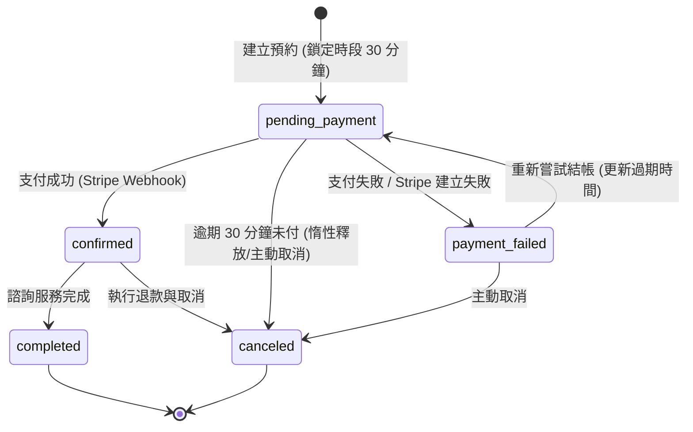
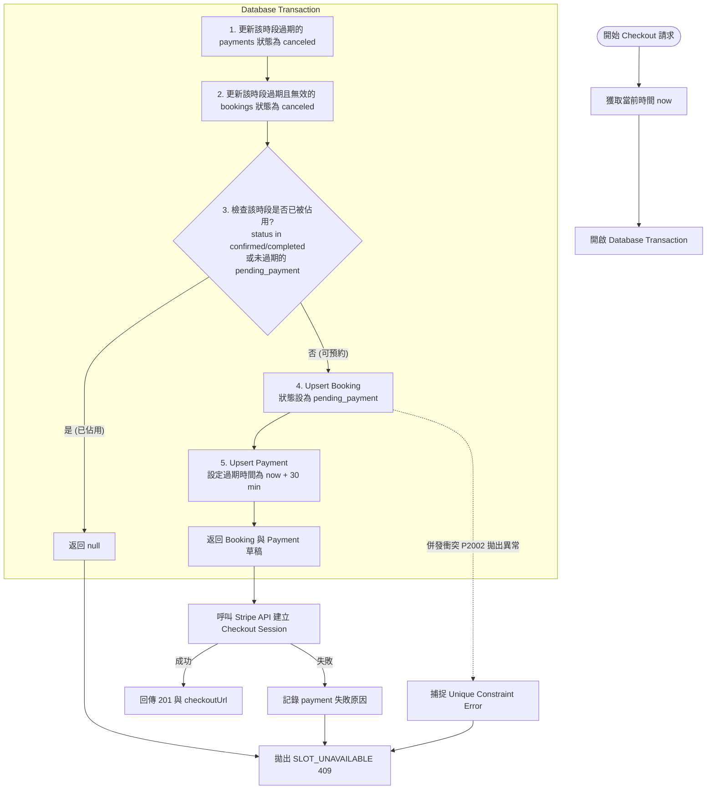

# 顧問預約時段併發防搶與狀態機設計文件

本文件說明 `POST /api/v1/consultations/checkout` API 如何在併發（Concurrency）環境下，安全鎖定預約時段、避免重複付款與超賣，並利用惰性釋放機制自動處理過期未付款的預約。

---

## 1. 核心設計挑戰

1. **併發搶訂**：兩位使用者同時送出相同的諮詢時段，必須確保只有一人能成功建立預約草稿並進入 Stripe 結帳頁面。
2. **時段鎖定與釋放**：
   - 使用者進入結帳頁面後，該時段應暫時鎖定（防搶）。
   - 若使用者在 **30 分鐘**內未完成付款，該鎖定必須被釋放，讓其他使用者可以預約該時段。
3. **資料庫層安全保證**：除了應用程式層的檢查，資料庫必須有唯一性限制（Unique Constraint），作為防範併發寫入的最後防線。

---

## 2. 併發防搶機制

我們結合了**資料庫唯一索引限制**與**惰性釋放機制**，並將整個判斷整合至單一資料庫交易（Transaction）中。

### A. 資料庫部分唯一索引 (Partial Unique Index)
在 `consultation_bookings` 資料表上建立如下的 index：
```sql
CREATE UNIQUE INDEX "consultation_bookings_slot_unique" 
ON "consultation_bookings"("consultation_date", "time_slot") 
WHERE "status" IN ('pending_payment', 'confirmed', 'completed');
```
* **作用**：在資料庫層級限制，同一個日期與時段，只允許存在一筆處於 `pending_payment`（付款中）、`confirmed`（已確認）或 `completed`（已完成）狀態的預約。
* **併發衝突處理**：當兩筆請求同時寫入同一時段時，資料庫會拋出 Unique Constraint 衝突錯誤 (`P2002`)，後端會將其捕捉並轉譯為 `SLOT_UNAVAILABLE` (409) 錯誤回傳給客戶端。

### B. 惰性釋放機制 (Lazy Release)
我們不使用複雜的背景定時任務（Cron Job）來清退過期訂單，而是在**每一次有新的預約請求進來時**，在交易內「順便」檢查並清理過期時段：
1. **定義過期**：`checkout_expires_at <= 系統當前時間` 且狀態為 `pending_payment`。
2. **惰性清理**：在建立新草稿前，批次將該時段內已過期的預約狀態更新為 `canceled`。
3. **釋放鎖定**：更新為 `canceled` 後，這些預約便不再符合 Partial Unique Index 的條件，該時段隨即釋放，供新請求使用。

---

## 3. 預約狀態機

預約在系統中的狀態流轉如下圖所示（時段鎖定主要發生於 `pending_payment`）：



---

## 4. 詳細交易流程圖 (API Checkout Transaction)

當使用者呼叫 `POST /api/v1/consultations/checkout` 時，後端在 `Prisma.$transaction` 內執行的核心邏輯如下：



---

## 5. 檔案關聯說明
* **資料庫定義**：[prisma/consultation.prisma](file:///c:/Users/user/asterism-backend/prisma/consultation.prisma)
* **交易邏輯實作**：[src/modules/consultation/repository.ts](file:///c:/Users/user/asterism-backend/src/modules/consultation/repository.ts) 中的 `createCheckoutDraft`
* **業務流程控制**：[src/modules/consultation/service.ts](file:///c:/Users/user/asterism-backend/src/modules/consultation/service.ts) 中的 `createConsultationCheckoutService`
