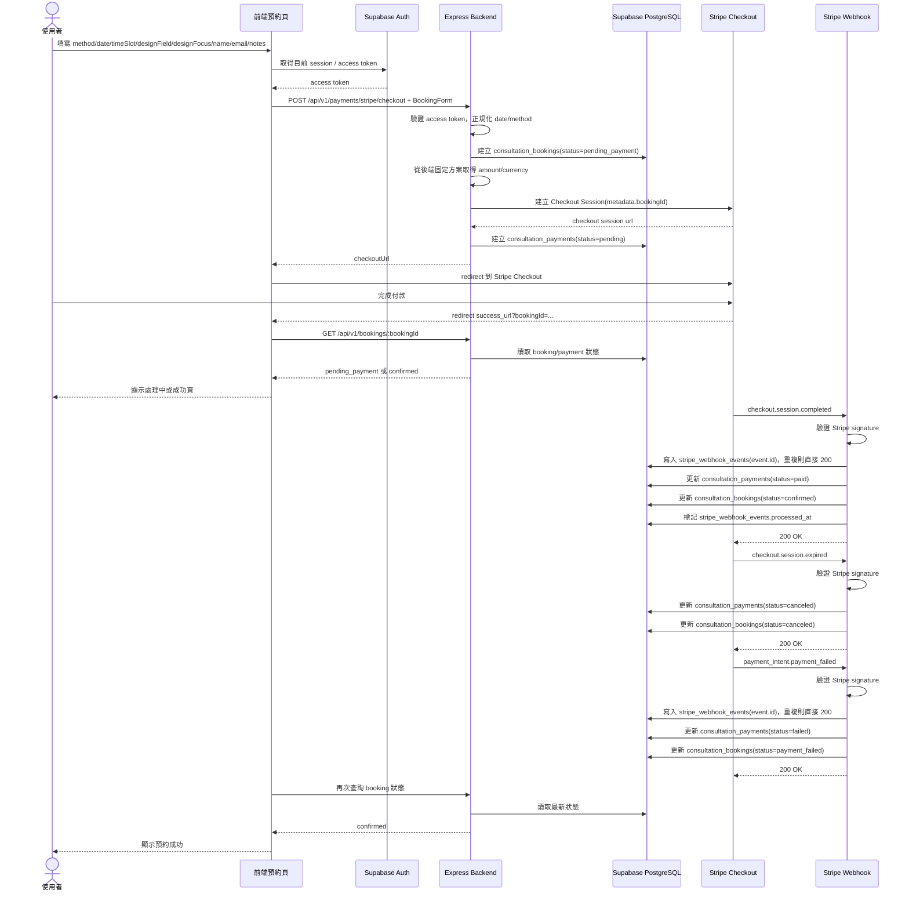

# 顧問預約金流整合決策

> 日期：2026-06-26  
> 結論：本專案顧問預約金流主線建議使用 Stripe 官方 Node SDK，不採用 Supabase Stripe Wrapper 作為付款流程核心。

## 1. Stripe 與 Paddle 差異

| 面向 | Stripe | Paddle | 本專案判斷 |
|---|---|---|---|
| 產品定位 | 支付基礎建設，適合自訂 checkout、訂單、預約、退款、invoice、webhook | Merchant of Record 平台，偏 SaaS、訂閱、全球稅務與合規代管 | 顧問預約是 booking/order-first，Stripe 較直接 |
| API 串接 | Checkout Session / PaymentIntent / Customer / Invoice API 成熟，Node SDK 生態大 | API 也完整，但商品、價格、交易、訂閱模型較 Paddle 化 | Stripe 和 Express 後端更貼合 |
| Webhook | 常用事件清楚，如 `checkout.session.completed`、`payment_intent.succeeded`、`invoice.paid` | 常用事件如 `transaction.completed`、`transaction.paid` | 兩者都可用；Stripe 範例與社群資料更多 |
| Invoice / receipt | 可由 Dashboard 設定自動寄送 receipt、finalized invoice、paid invoice PDF，也可 API 建 invoice | Paddle 會寄送交易與訂閱相關 email，invoice 流程偏 sales-led/subscription | 若是單次顧問預約付款，Stripe 足夠 |
| 多國貨幣 | 支援 135+ presentment currencies，包含 TWD | 支援 30+ payment currencies，包含 TWD | 兩者都符合 |
| TWD 注意事項 | TWD 可收款；payout 有特殊整數規則 | 可用 TWD 收款；payout balance 幣別限 USD/EUR/GBP/AUD/CAD | 若重視台幣與銀行出金細節，Stripe 彈性較高 |
| Sandbox / 測試 | Test mode、test keys、test cards、Stripe CLI webhook forwarding | 獨立 sandbox account、test keys、test cards | 兩者都符合 |
| 稅務責任 | 預設商家自己負責；可另評估 Stripe Tax / Managed Payments | Paddle 作為 Merchant of Record 是強項 | 若核心痛點是全球稅務代管，才改選 Paddle |
| 前端整合 | Hosted Checkout 最省，成功後回前端查後端狀態 | Paddle.js 也可做 checkout | Stripe 最短路徑 |

**結論：選 Stripe。**  
本專案目前需要的是「建立預約、付款、webhook 確認、更新預約狀態」，不是跨國 SaaS Merchant of Record 架構。Stripe 的 Checkout Session + webhook 剛好對上，而且可以把 `bookingId` 放在 `client_reference_id` 或 `metadata` 做後端對帳。

Paddle 適合等到這些條件成立再評估：

- 主要商品變成跨國 SaaS 訂閱。
- 想把 VAT/GST/sales tax 與銷售合規責任交給 Merchant of Record。
- 願意接受 Paddle 的商品、價格、交易模型成為金流主模型。

參考：

- [Stripe Checkout](https://docs.stripe.com/payments/checkout)
- [Stripe Checkout Session API](https://docs.stripe.com/api/checkout/sessions/create)
- [Stripe currencies](https://docs.stripe.com/currencies)
- [Stripe invoice emails](https://docs.stripe.com/invoicing/send-email)
- [Paddle supported currencies](https://developer.paddle.com/concepts/sell/supported-currencies/)
- [Paddle webhooks](https://developer.paddle.com/webhooks/)
- [Paddle invoices](https://developer.paddle.com/concepts/sell/sales-assisted-invoice/)
- [Paddle sandbox](https://developer.paddle.com/sdks/sandbox/)

## 2. 是否採用 Supabase Stripe Wrapper

**不建議把 Supabase Stripe Wrapper 放在主付款流程。**

Supabase 的 Stripe Wrapper 是 Postgres Foreign Data Wrapper，核心用途是讓資料庫查詢 Stripe 資料。它可以把 Stripe 物件映射成 foreign tables，例如 charges、checkout sessions、customers、invoices、payment intents。這對後台查帳或資料比對有用，但不是建立 Checkout Session、驗證 webhook、處理付款狀態轉移的最短路徑。

| 用法 | 建議 |
|---|---|
| 建立 Checkout Session | 用後端 `stripe` Node SDK |
| 驗證 Stripe webhook signature | 用後端 `stripe.webhooks.constructEvent()` |
| 更新 booking/payment 狀態 | 後端 webhook 寫入 Supabase PostgreSQL |
| 後台查帳、對帳查詢 Stripe 物件 | 之後可考慮 Supabase Stripe Wrapper |
| 前端直接查 Stripe wrapper foreign tables | 不建議，金流資料不要暴露給前端 |

本專案目前是 Supabase-first，但有一條清楚邊界：

```text
普通 CRUD / 使用者資料：Supabase Auth + Auto API + RLS
金流 secret / webhook / 狀態落庫：Express backend
```

所以現在採用：

```text
stripe Node SDK + Express webhook + Supabase PostgreSQL
```

Skipped Supabase Stripe Wrapper in the payment path, add it only when admin reconciliation actually needs SQL access to Stripe objects.

參考：

- [Supabase Stripe Wrapper](https://supabase.com/docs/guides/database/extensions/wrappers/stripe)

## 3. 前端目前欄位採納

目前前端顧問諮詢表單在 `Asterism\src\components\feature\consultant\RecommendationPanel.vue`，送出的 payload 是：

```ts
type ConsultationMethod = 'online' | 'in-person'
type TimeSlot = '' | 'am' | 'pm'

interface BookingForm {
  method: ConsultationMethod
  date: string
  timeSlot: TimeSlot
  designField: string
  designFocus: string
  name: string
  email: string
  notes: string
}
```

| 前端欄位 | 目前格式 / 選項 | 後端建議欄位 | 說明 |
|---|---|---|---|
| `method` | `online` / `in-person`，預設 `online` | `method` | 直接保留；不要拆成多表 |
| `date` | `MM / DD / YYYY` 字串 | `consultation_date` | 後端要轉成 `date`，不要直接存 UI 字串 |
| `timeSlot` | `am` / `pm` | `time_slot` | 目前不是精準時間；先用半日時段 |
| `designField` | `Styling design`、`Graphic Design`、`Interior Design`、`Architecture` | `design_field` | 目前前端未設為必填；後端可先允許空字串 |
| `designFocus` | `Spatial mood`、`Material palette`、`Color direction`、`Furniture selection`、`Visual concept` | `design_focus` | 目前前端未設為必填；後端可先允許空字串 |
| `name` | 文字，必填 | `customer_name` | 可由 account info 帶入，也可手動填 |
| `email` | 包含 `@`，必填 | `customer_email` | 後端仍要做基本 email validation |
| `notes` | textarea，自由輸入 | `notes` | 顧問需求描述 |

前端還有 `accountName`、`accountEmail` props 與「Use my account info」按鈕。這只是表單 autofill，不需要後端另外建欄位；後端以 Supabase access token 的 `profileId/userId` 當身分依據，以 payload 的 `name/email` 當這次預約聯絡資料。

### Review 後採納的 MVP 調整

- 金額與幣別只能由後端決定，前端不得送 `amount` / `currency`。
- MVP 先用後端固定方案設定，例如 `CONSULTATION_PRICE_AMOUNT=120000`、`CONSULTATION_CURRENCY=TWD`；有多方案或後台改價需求時，再新增 `consultation_services`。
- 前端目前送 `in-person`；後端可先接收這個值，但落庫建議正規化成 `in_person`。
- `profiles.id` 在本 repo 已對應 Supabase Auth user id，所以 booking 欄位沿用既有命名 `profile_id`。
- webhook 必須有 idempotency 記錄表，不能只把 raw event 塞在 payment 裡。

現階段不要新增：

- `customer_phone`：前端沒有欄位。
- `scheduled_at` 必填：前端只有日期與 AM/PM，沒有精準開始時間。
- 顧問方案 / price plan table：MVP 先用後端固定方案；等有多方案再加表。
- 多金流 provider interface：目前只選 Stripe。

## 4. 後端檔案結構建議

目前後端是 Express + Prisma + Supabase PostgreSQL，最小新增結構如下：

```text
src/
  app.ts
  config/
    env.ts
  db/
    prisma.ts
  modules/
    bookings/
      booking.routes.ts
      booking.service.ts
      booking.types.ts
    payments/
      stripe.routes.ts
      stripe.service.ts
      stripe.webhook.ts
      stripe.types.ts
      stripeWebhookEvent.service.ts
  middleware/
    requireAuth.ts
    errorHandler.ts

prisma/
  consultation.prisma
  migrations/
    <timestamp>_consultation_bookings/
      migration.sql
```

| 檔案 | 職責 |
|---|---|
| `src/modules/bookings/booking.routes.ts` | 提供前端建立預約、查詢預約狀態的 API |
| `src/modules/bookings/booking.service.ts` | 建立 pending booking、查 booking、更新 booking 狀態 |
| `src/modules/payments/stripe.routes.ts` | `POST /api/v1/payments/stripe/checkout` 與 webhook route 掛載 |
| `src/modules/payments/stripe.service.ts` | 呼叫 Stripe SDK 建立 Checkout Session |
| `src/modules/payments/stripe.webhook.ts` | 驗證 webhook signature，處理 `checkout.session.completed` / `checkout.session.expired` |
| `src/modules/payments/stripeWebhookEvent.service.ts` | 記錄 `stripe_webhook_events`，避免重複處理同一個 webhook |
| `src/middleware/requireAuth.ts` | 驗證 Supabase access token，取得 `profileId/userId` |
| `prisma/consultation.prisma` | 定義 `consultation_bookings`、`consultation_payments` |

### 重要實作注意

Stripe webhook 需要 raw body 驗簽。現在 `src/app.ts` 有全域 `app.use(express.json())`，未來加 webhook 時要讓 webhook route 在 JSON parser 前面使用 raw parser：

```ts
app.post(
  '/api/v1/payments/stripe/webhook',
  express.raw({ type: 'application/json' }),
  stripeWebhookHandler
)

app.use(express.json())

app.use('/api/v1/payments/stripe/checkout', requireAuth, stripeCheckoutRoutes)
app.use('/api/v1/bookings', requireAuth, bookingRoutes)
```

這是必要安全檢查，不要省。Webhook route 不走 `requireAuth`，它的身分驗證來源是 Stripe signature，不是 Supabase access token。

### 建議資料表

```text
consultation_bookings
- id uuid primary key
- profile_id uuid references profiles(id)
- method text -- online / in_person
- consultation_date date
- time_slot text -- am / pm
- timezone text default 'Asia/Taipei'
- design_field text nullable
- design_focus text nullable
- customer_name text
- customer_email text
- notes text nullable
- status text -- pending_payment / confirmed / payment_failed / canceled / completed
- created_at timestamptz
- updated_at timestamptz

consultation_payments
- id uuid primary key
- booking_id uuid unique references consultation_bookings(id)
- provider text default 'stripe'
- provider_checkout_session_id text unique
- provider_payment_intent_id text unique nullable
- amount integer -- backend-owned
- currency text default 'TWD' -- backend-owned
- status text -- pending / paid / failed / canceled / refunded
- checkout_expires_at timestamptz nullable
- paid_at timestamptz nullable
- created_at timestamptz
- updated_at timestamptz

stripe_webhook_events
- id uuid primary key
- stripe_event_id text unique
- event_type text
- payload jsonb
- processed_at timestamptz nullable
- created_at timestamptz
```

先不要新增抽象 payment provider interface。現在只有 Stripe，一個 `provider = 'stripe'` 欄位夠用。

後端建立 Checkout Session 時從固定方案設定讀取 `amount` / `currency`，再寫入 `consultation_payments`。前端只送預約欄位，不送價格。

### 實作前安全補強

Prisma schema / migration 需要明確落下 DB constraint，不只靠 TypeScript 型別：

```sql
-- consultation_bookings
check (method in ('online', 'in_person'))
check (time_slot in ('am', 'pm'))
check (status in ('pending_payment', 'confirmed', 'payment_failed', 'canceled', 'completed'))

-- consultation_payments
check (provider in ('stripe'))
check (status in ('pending', 'paid', 'failed', 'canceled', 'refunded'))
check (amount > 0)
unique (booking_id)
unique (provider_checkout_session_id)
unique (provider_payment_intent_id)

-- stripe_webhook_events
unique (stripe_event_id)
```

`provider_payment_intent_id` 在 Checkout 建立初期可能還沒有值，所以允許 nullable。PostgreSQL unique constraint 允許多筆 `NULL`，這個設計可行。

Checkout 建立流程不能留下半套資料。MVP 採用補償策略：

1. 驗證 payload 與 profile。
2. 正規化 `method` / `date`。
3. 從後端固定方案取得 `amount` / `currency`。
4. 建立 `consultation_bookings(status=pending_payment)`。
5. 呼叫 Stripe 建立 Checkout Session。
6. 建立 `consultation_payments(status=pending)`。
7. 若 Stripe session 建立失敗，將 booking 標記為 `canceled`。
8. 若 payment 寫入失敗，記錄錯誤並將 booking 標記為 `canceled`；不要讓前端取得可用 checkout URL。

外部 Stripe API 不能被真正包進 DB transaction 完美回滾，所以先用「失敗就取消 booking」的補償策略。不要為 MVP 建 payment attempts。

TODO：若後續出現多方案、顧問自訂價格、後台改價或歷史價格追蹤需求，需新增 `consultation_services`，並讓 `consultation_bookings` reference service id。MVP 固定價格只作為短期實作策略。

## 5. 功能流程圖



### 狀態規則

| 狀態 | 觸發來源 | 說明 |
|---|---|---|
| `pending_payment` | 後端建立 booking | 已保留預約資料，等待付款 |
| `confirmed` | Stripe webhook | 付款成功，顧問預約正式成立 |
| `payment_failed` | Stripe webhook | 付款失敗 |
| `canceled` | 使用者取消或 checkout 過期 | 釋放預約 |
| `completed` | 顧問服務結束後 | 服務已完成 |

付款狀態獨立放在 `consultation_payments.status`：`pending`、`paid`、`failed`、`canceled`、`refunded`。不要把 booking status 設成 `paid`，付款成功時是 payment `paid`，booking `confirmed`。

MVP 主要處理 `checkout.session.completed` 與 `checkout.session.expired`。若收到付款失敗事件，例如 `payment_intent.payment_failed`，則將 `consultation_payments.status` 設為 `failed`，並將 `consultation_bookings.status` 設為 `payment_failed`。

前端 success page 不要只看 Stripe redirect URL 就顯示成功。它應該向後端查詢 booking 狀態，因為 webhook 可能比 redirect 慢幾秒。

## 6. 最小落地順序

1. 在 Prisma 新增 `consultation_bookings`、`consultation_payments`、`stripe_webhook_events`。
2. 新增 `requireAuth`，後端驗證 Supabase access token。
3. 新增後端固定方案設定，讓 amount/currency 只從後端來。
4. 新增 `POST /api/v1/payments/stripe/checkout`，建立 pending booking、pending payment 和 Stripe Checkout Session。
5. 新增 Stripe webhook route，處理 `checkout.session.completed`、`checkout.session.expired`，並用 `stripe_webhook_events.stripe_event_id` 做 idempotency。
6. 新增 `GET /api/v1/bookings/:id`，讓前端 success page 查狀態。
7. Dashboard 只做查詢與 debug，不手改 schema。

這條路徑保留 Supabase-first，不把普通 CRUD 搬回 Express，也不提前做多金流 provider 抽象。
