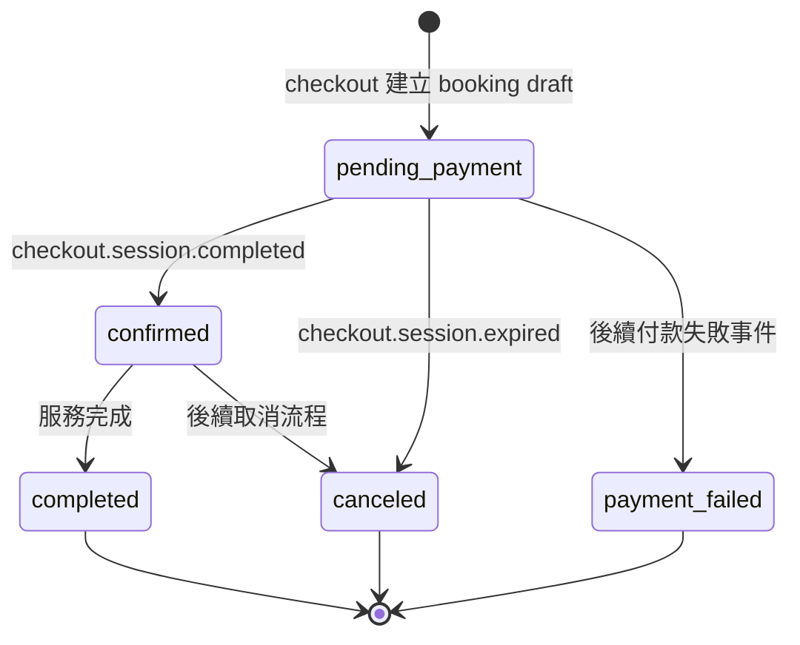
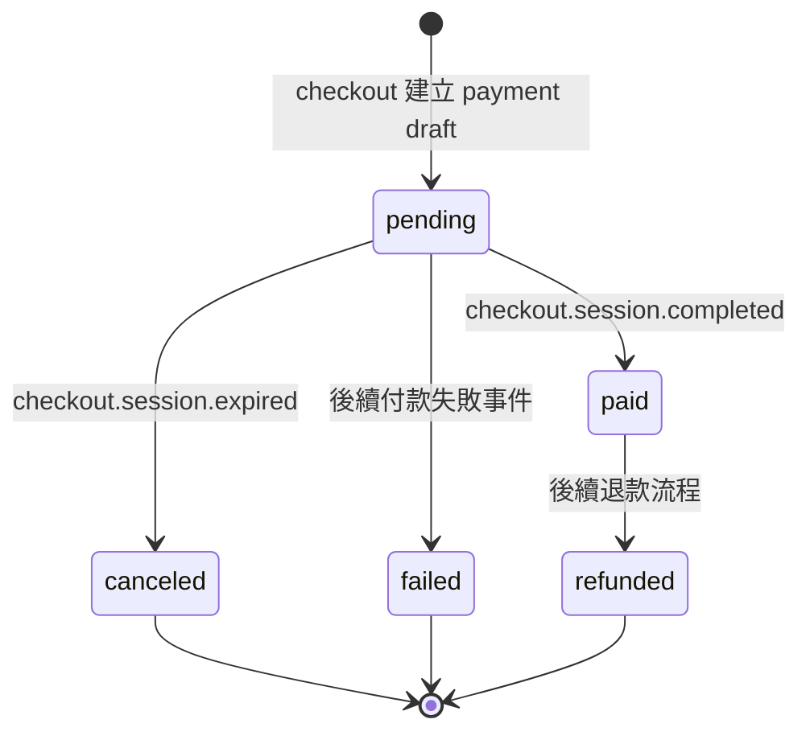
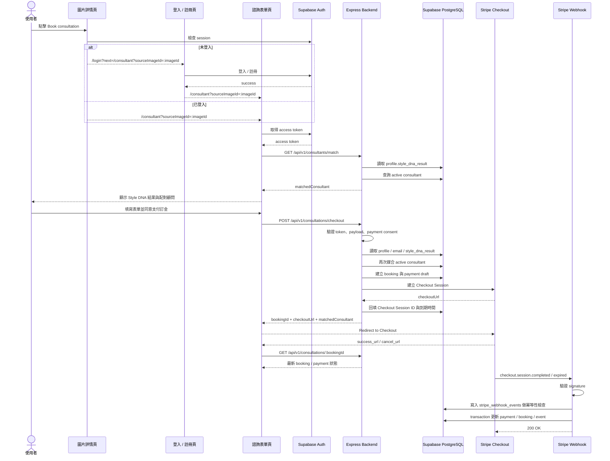

# 顧問預約與金流技術規格設計書

> 更新日期：2026-07-02  
> 狀態：Planned  
> 版本：v3  
> 適用範圍：顧問預約、Stripe Checkout、Stripe Webhook、顧問媒合、付款狀態同步  
> 關聯文件：  
> - 系統架構：[Asterism 後端架構規劃](./asterism-backend-architecture.md)  
> - API Contract：[顧問預約與金流 API Contract](./asterism-api-list-v1.md)  
> - 顧問媒合邏輯：[顧問媒合邏輯技術規格](./consultant-matching-spec.md)  
> - 金流選型：[顧問預約金流整合決策](./consultation-payment-provider-decision.md)

本文件定義 Asterism 顧問預約與 Stripe Checkout 的技術規格。主線流程為：使用者登入後建立顧問預約，後端產生聯絡資訊快照與顧問媒合結果，建立固定 NT$500 訂金 Checkout Session，最後由 Stripe webhook 同步付款與預約狀態。

本文件聚焦於資料模型、流程、狀態機、安全邊界與責任分層。完整 endpoint、request body、response、validation 與錯誤格式請見 API Contract 文件。

---

## 1. 設計原則

- 建立預約與金流流程必須走 Express Backend，不直接由前端 insert booking 或 payment。
- Stripe webhook 是付款狀態的主要真相來源；前端 success / cancel redirect 只能作為畫面提示。
- 前端不得傳入或控制金額、付款狀態、預約狀態、顧問媒合結果、Stripe session / intent id。
- 使用者身分必須由 Supabase Access Token 解析，不信任前端傳入的 `userId` 或 `profileId`。
- 聯絡資料以建立預約當下的 `profiles` / Auth user email 產生快照。
- `profiles.style_dna_result` 只保存 Style DNA 結果摘要，不保存 consultant 顯示文字或媒合結果。
- `Consultant` 是獨立業務實體，不塞進 JSON 欄位。
- 前端可顯示 matched consultant，但 checkout 時後端仍需重新媒合 active consultant。
- Webhook 狀態更新必須具備 signature verification、idempotency 與 transaction。
- 退款補償流程保留資料欄位與狀態設計，但不混入第一版 webhook 狀態同步主流程。

---

## 2. Source of Truth

| 資料 | 真相來源 |
|---|---|
| `userId` | Supabase Auth session |
| `profileId` | 後端根據 `userId` 查詢 `profiles` |
| `email` | Supabase Auth / profiles |
| `contactName` | 後端從 profiles 產生快照，MVP 可 nullable |
| `contactEmail` | 後端從 Auth user email 產生快照 |
| `amount` / `currency` | 後端 price config / Stripe Price ID |
| `paymentStatus` | Stripe webhook / 後端 payment service |
| `bookingStatus` | 後端 consultation service |
| `consultantId` | 後端 consultant-match service |
| `providerCheckoutSessionId` | 後端建立 Stripe Checkout Session 後寫入 |
| `providerPaymentIntentId` | Stripe webhook / Stripe API 回寫 |
| `paidAt` | Stripe webhook 確認付款後寫入 |

---

## 3. 前端表單與可信 Payload

### 3.1 前端顯示與送出欄位

| 顯示區塊 | 說明 | 是否送給後端 |
|---|---|---:|
| Matched Consultant | 後端媒合結果，前端只顯示 | no |
| Style DNA Result | 由登入後 profile 帶入，用於說明媒合依據 | no |
| Consultation Method | 諮詢方式 | yes |
| Date | 諮詢日期 | yes |
| Time Slot | 諮詢時段 | yes |
| Design Field | 設計領域 | yes |
| Design Focus | 設計重點 | yes |
| Contact Information | 由登入後 profile / auth 自動帶入 | no |
| Additional Notes | 自由輸入備註 | yes |
| Consultation Fee | 固定 NT$500 deposit | no |
| Payment Agreement | 使用者同意支付訂金 | yes，只送布林確認 |

### 3.2 前端不得傳入欄位

以下欄位不應由前端 request body 傳入或控制：

```txt
userId
profileId
role
isAdmin
price
amount
currency
status
bookingStatus
paymentStatus
consultantId
matchedConsultantId
createdAt
updatedAt
paidAt
stripeSessionId
stripePaymentIntentId
```

後端 schema validation 應拒絕 unknown fields，並由 service 層從可信來源補齊資料。

### 3.3 欄位對齊

| 前端 payload / 來源 | 後端資料庫欄位 | 說明 |
|---|---|---|
| `method` | `method` | `in-person` 落庫時正規化為 `in_person` |
| `consultationDate` | `consultation_date` | 後端轉為標準 date |
| `timeSlot` | `time_slot` | `am` / `pm` |
| `designField` | `design_field` | Nullable |
| `designFocus` | `design_focus` | Nullable |
| `sourceImageId` | `source_image_id` | Nullable |
| `notes` | `notes` | Nullable |
| `paymentConsentAccepted` | `payment_consent_accepted_at` | 必須為 `true`，後端落庫為 timestamp |
| access token | `profile_id` | 後端由 Supabase token 解析 |
| profile / auth | `contact_name`、`contact_email` | 後端產生當下快照 |
| profile `style_dna_result` | `consultant_id` | 後端媒合 active consultant 後寫入 |

---

## 4. Auth 與入口規則

建立 consultation booking 前必須登入。後端不接受匿名 booking，也不接受前端傳入的 `name`、`email`、`consultantId` 作為可信資料。

| 規則 | 說明 |
|---|---|
| 未登入入口 | 從圖片詳情點擊 `Book consultation` 時，前端導向 `/login?next=/consultant?sourceImageId=:imageId` |
| 登入後返回 | 登入 / 註冊成功後回到 `/consultant?sourceImageId=:imageId` |
| 已登入入口 | 直接進入 `/consultant?sourceImageId=:imageId` |
| 身分來源 | 後端由 Supabase Access Token 取得 `profile_id` |
| Style DNA 來源 | 後端從 `profiles.style_dna_result` 取得媒合依據 |
| 顧問媒合 | 後端依 Style DNA 結果媒合 active consultant |
| 聯絡資料 | 後端從 `profiles` / Auth user email 產生快照 |
| 來源圖片 | 前端從 query 取得 `sourceImageId`，送出後由後端存為 `source_image_id` |
| 付款結果 | 前端 redirect 只作為提示，實際狀態需重新查詢後端 |

---

## 5. 金額與方案

- Stripe 只有一項商品 / Price：NT$500 consultation deposit。
- 前端只顯示金額，不送金額。
- 後端透過環境變數保存 Stripe Price ID，例如 `STRIPE_CONSULTATION_PRICE_ID`。
- DB 可記錄本次 checkout 的 `amount`、`currency`、`stripe_price_id`，但值必須由後端設定或 Stripe 回傳，不可由前端決定。
- Stripe Price 必須為 active、TWD 且 `unit_amount = 50000`。
- Demo 文案可標示：`For demo purposes only. No real payment will be charged.`

---

## 6. 模組責任與檔案結構

完整 Backend Repo 結構由 [Asterism 後端架構規劃](./asterism-backend-architecture.md) 維護。本文件只列顧問預約與 Stripe 金流直接相關模組。

```txt
src/modules/
  consultations/
    routes.ts
    schema.ts
    service.ts
    repository.ts
    types.ts

  payments/
    routes.ts
    stripe-webhook.routes.ts
    stripe.service.ts
    stripe-webhook-event.service.ts
    repository.ts
    types.ts

  consultant-match/
    service.ts
    repository.ts
    types.ts

  consultants/
    routes.ts
    schema.ts
    service.ts
    repository.ts
    types.ts
```

| 檔案 | 責任 |
|---|---|
| `routes.ts` | 接 HTTP request、取得 auth context、呼叫 schema validation、呼叫 service |
| `schema.ts` | 驗證 body / query / params、拒絕 unknown fields、禁止 client 傳入敏感欄位 |
| `service.ts` | business logic、狀態流轉、付款流程、顧問配對流程 |
| `repository.ts` | 封裝 Prisma query，不放複雜 business logic |
| `types.ts` | module 內部共用型別 |
| `stripe-webhook.routes.ts` | 使用 raw body 處理 Stripe webhook route |

---

## 7. 資料庫 Schema 設計

### 7.1 `consultants`

顧問為獨立業務實體，用於顧問媒合、預約紀錄與未來後台管理。MVP 階段先建立少量 seed data，不實作完整排班與負載分配。

| 欄位 | 型別 | 說明 |
|---|---|---|
| `id` | `uuid` | Primary Key |
| `display_name` | `varchar(80)` | 顧問顯示名稱 |
| `title` | `varchar(80)` | 顧問職稱 |
| `avatar_url` | `text` | Nullable，顧問頭像 |
| `bio` | `text` | Nullable，顧問簡介 |
| `specialty` | `ConsultantSpecialty` | Nullable，MVP 媒合用分類 |
| `is_active` | `boolean` | 是否可被媒合 |
| `created_at` | `timestamptz` | 建立時間 |
| `updated_at` | `timestamptz` | 更新時間 |

建議 enum：

```txt
spatial
visual_styling
concept_design
```

### 7.2 `consultation_bookings`

| 欄位 | 型別 | 說明 |
|---|---|---|
| `id` | `uuid` | Primary Key |
| `profile_id` | `uuid` | references `profiles.id` |
| `idempotency_key` | `uuid` | request `Idempotency-Key`，與 `profile_id` 組成 unique |
| `consultant_id` | `uuid` | references `consultants.id`, Nullable |
| `source_image_id` | `text` | references `images.id`, Nullable |
| `method` | `text` | `online` / `in_person` |
| `consultation_date` | `date` | 預約日期 |
| `time_slot` | `text` | `am` / `pm` |
| `design_field` | `text` | Nullable |
| `design_focus` | `text` | Nullable |
| `contact_name` | `text` | 後端由 profile 產生的快照，Nullable |
| `contact_email` | `text` | 後端由 Auth user email 產生的快照 |
| `contact_phone` | `text` | Nullable，目前前端 payload 不必填 |
| `notes` | `text` | Nullable |
| `payment_consent_accepted_at` | `timestamptz` | 使用者同意 NT$500 deposit 的時間 |
| `status` | `text` | `pending_payment` / `confirmed` / `payment_failed` / `canceled` / `completed` |
| `created_at` | `timestamptz` | 建立時間 |
| `updated_at` | `timestamptz` | 更新時間 |

`consultant_id` 代表本次預約實際媒合到的顧問。若顧問資料未來被停用或刪除，歷史 booking 不應被刪除，因此 relation 建議使用 `onDelete: SetNull`。

### 7.3 `consultation_payments`

| 欄位 | 型別 | 說明 |
|---|---|---|
| `id` | `uuid` | Primary Key |
| `booking_id` | `uuid` | references `consultation_bookings.id`, Unique |
| `provider` | `text` | 預設 `stripe` |
| `stripe_price_id` | `text` | 固定 NT$500 deposit 的 Stripe Price ID |
| `provider_checkout_session_id` | `text` | Stripe Checkout Session ID，Unique, Nullable |
| `provider_payment_intent_id` | `text` | Stripe Payment Intent ID，Unique, Nullable |
| `amount` | `integer` | 後端紀錄的本次收款金額 |
| `currency` | `varchar(3)` | 預設 `TWD` |
| `status` | `text` | `pending` / `paid` / `failed` / `canceled` / `refunded` |
| `checkout_expires_at` | `timestamptz` | Nullable |
| `paid_at` | `timestamptz` | Nullable |
| `refunded_at` | `timestamptz` | Nullable |
| `provider_refund_id` | `text` | Stripe Refund ID，Unique, Nullable |
| `failed_at` | `timestamptz` | Nullable |
| `canceled_at` | `timestamptz` | Nullable |
| `failure_reason` | `text` | Nullable |
| `created_at` | `timestamptz` | 建立時間 |
| `updated_at` | `timestamptz` | 更新時間 |

### 7.4 `stripe_webhook_events`

| 欄位 | 型別 | 說明 |
|---|---|---|
| `id` | `uuid` | Primary Key |
| `stripe_event_id` | `text` | Stripe event id，Unique |
| `event_type` | `text` | 例如 `checkout.session.completed` |
| `payload` | `jsonb` | 原始事件 payload，僅供後端除錯與稽核使用 |
| `processed_at` | `timestamptz` | Nullable，處理時間 |
| `processing_error` | `text` | Nullable，處理失敗原因 |
| `created_at` | `timestamptz` | 建立時間 |

`stripe_webhook_events.payload` 不開放 Supabase Auto API 或一般使用者讀取。

### 7.5 DB Constraints

建議保留以下 DB-level constraint：

- `consultation_bookings.method` 僅允許 `online` / `in_person`。
- `consultation_bookings.time_slot` 僅允許 `am` / `pm`。
- `consultation_bookings.status` 僅允許合法 booking status。
- `consultation_bookings.payment_consent_accepted_at` 不可為 null。
- `consultation_payments.provider` 僅允許 `stripe`。
- `consultation_payments.status` 僅允許合法 payment status。
- `consultation_payments.amount` 必須大於 0。
- `consultation_date + time_slot` 應有 partial unique index，避免 confirmed / completed 預約重複占用同一時段。

`checkout` service 仍需在建立 booking 前做可用性檢查，讓使用者早點得到錯誤；DB partial unique index 是避免 double-booking 的最後防線。

---

## 8. Supabase Auto API 使用界線與 RLS

| 資料 / 功能 | Supabase Auto API | Express Backend | 說明 |
|---|---:|---:|---|
| 讀取 active consultants 公開資料 | 可以 | 可以 | 僅限 `is_active = true` 且欄位為公開顯示資訊 |
| 顧問媒合 | 不建議 | 必須 | 需讀取 profile、解析 Style DNA、套用 fallback |
| 建立 consultation booking | 不建議 | 必須 | 需同時處理顧問媒合、contact snapshot、付款狀態 |
| 建立 Stripe Checkout Session | 不可 | 必須 | 需要 Stripe secret key |
| Stripe webhook | 不可 | 必須 | 需要 raw body 與 signature verification |
| 更新 payment status | 不可 | 必須 | 只能由 backend / webhook 控制 |

RLS 建議：

- `consultants`：允許前端讀取 `is_active = true` 的公開欄位；禁止一般使用者 insert / update / delete。
- `consultation_bookings`：使用者只能讀取自己的 booking；不得由前端直接 insert payment-related booking。
- `consultation_payments`：使用者只能讀取自己的 payment 狀態；不得由前端 insert / update。
- `stripe_webhook_events`：不開放前端存取。
- `service_role key` 只能在 server 使用，不得出現在前端。

---

## 9. API 設計引用

顧問預約、Stripe 金流、顧問配對與預約查詢 API contract 統一維護於：

- [顧問預約與金流 API Contract](./asterism-api-list-v1.md)

本文件僅定義 API 在整體流程中的責任邊界：

| API | 責任 |
|---|---|
| `POST /api/v1/consultations/checkout` | 建立 booking / payment draft，並建立 Stripe Checkout Session |
| `POST /api/v1/payments/stripe/webhook` | 接收 Stripe event，驗簽後同步 payment / booking 狀態 |
| `GET /api/v1/consultations/:bookingId` | 讓前端查詢付款後最新 booking / payment 狀態 |
| `GET /api/v1/consultants/match` | 提供前端顯示用顧問媒合結果 |
| `GET /api/v1/consultations/availability` | 提供指定日期可預約時段的 UX 提示 |

完整 headers、request body、response、validation 與錯誤情境，請以 API Contract 文件為準。

---

## 10. Stripe Webhook 規格

### 10.1 Raw Body 與 route 順序

Stripe webhook 驗證簽章需要原始請求主體，因此 webhook route 必須掛在 `express.json()` 之前。

```txt
POST /api/v1/payments/stripe/webhook
→ express.raw({ type: 'application/json' })
→ stripe signature verification
→ business handler

express.json()
→ 其他 API routes
```

### 10.2 付款狀態真相來源

- `success_url` 不代表付款成功。
- `cancel_url` 不代表付款狀態一定已取消。
- 前端返回 `/consultant?payment=success|cancel` 後，應重新查詢 booking 狀態。
- `paymentStatus` 與 `bookingStatus` 只能由後端 service / webhook 更新。

### 10.3 支援事件範圍

第一版 webhook 主流程只處理：

```txt
checkout.session.completed
checkout.session.expired
```

其他事件可先記錄或忽略，不更新 booking / payment 狀態。`payment_intent.payment_failed`、`charge.refunded`、`refund.updated` 屬於後續擴充事件。

### 10.4 Webhook 處理規則

1. 使用 raw body 與 `Stripe-Signature` header 驗證 Stripe signature。
2. 驗簽失敗時，不寫入 webhook event，不更新 booking / payment，並回傳非 2xx。
3. 驗簽成功後，先嘗試寫入 `stripe_webhook_events.stripe_event_id`。
4. 若 `stripe_event_id` 已存在：
   - `processed_at` 已存在：直接回傳 `200 OK`。
   - `processed_at` 為 null：不重複更新 booking / payment，記錄狀態供後續檢查。
5. 透過 `checkout.session.id` 查詢 `consultation_payments.provider_checkout_session_id`。
6. 若找不到對應 payment：
   - 不建立未知 booking 或 payment。
   - 不更新任何 booking / payment。
   - 將原因寫入 `stripe_webhook_events.processing_error`。
7. 若找到 payment，使用 Prisma transaction 更新：
   - `consultation_payments`
   - `consultation_bookings`
   - `stripe_webhook_events.processed_at`
8. 任一狀態更新失敗時，不得標記該 event 為 processed。

### 10.5 Transaction 規則

Webhook 對 `consultation_payments`、`consultation_bookings`、`stripe_webhook_events` 的狀態更新必須包在同一個 Prisma transaction 中。

同一筆 Stripe event 對應的資料更新應符合 all-or-nothing：

- payment 狀態更新
- booking 狀態更新
- webhook event `processed_at` 更新

任一更新失敗時，不應標記該 event 為 processed。

### 10.6 退款補償邊界

若付款成功後更新 booking 為 `confirmed` 時發生時段衝突，第一版流程先記錄錯誤並保留人工處理依據，不自動呼叫 Stripe Refund。

退款補償流程需要另行定義：

- Stripe Refund API
- refund id
- refund status
- refund failed 錯誤原因
- booking 狀態是否同步變更
- 是否需要人工處理後台

---

## 11. 顧問媒合流程

顧問媒合細節由 [顧問媒合邏輯技術規格](./consultant-matching-spec.md) 維護。本文件只保留在預約與金流流程中的使用位置：

- 顧問諮詢頁載入時，前端呼叫 `GET /api/v1/consultants/match` 顯示 matched consultant。
- 建立 checkout booking 前，後端必須再次執行顧問媒合，並將結果寫入 `consultation_bookings.consultant_id`。
- 前端不得在 checkout payload 中傳入 `consultantId`、`consultantName` 或 `consultantTitle`。
- 顧問媒合只能使用 `is_active = true` 的顧問。
- 若無 active consultant，後端不得建立 checkout session。

---

## 12. 狀態機

### 12.1 Booking / Payment 狀態對照

| 情境 | `consultation_bookings.status` | `consultation_payments.status` | 說明 |
|---|---|---|---|
| 初始化建立 | `pending_payment` | `pending` | transaction 先建立 booking 與 payment draft，再建立並回填 Checkout Session |
| 付款成功 | `confirmed` | `paid` | Webhook 確認付款完成 |
| 付款逾期 | `canceled` | `canceled` | Checkout Session expired |
| 付款失敗 | `payment_failed` | `failed` | 保留狀態，後續擴充對應 event |
| 退款 | `canceled` | `refunded` | 後續退款流程處理 |
| 服務完成 | `completed` | `paid` | 顧問服務完成 |

### 12.2 Mermaid 狀態圖





---

## 13. 功能流程圖



---

## 14. 最小落地順序

1. **Prisma migration**
consultants、consultation_bookings、consultation_payments、stripe_webhook_events、constraints。
2. **Consultant seed**
建立 1～3 位 MVP consultant，至少一位 `is_active = true`。
3. **Auth middleware**
由 Supabase Access Token 取得 auth context。
4. **Consultant match**
實作顧問媒合查詢與 fallback。
5. **Checkout**
建立 booking / payment draft，回填 Stripe Checkout Session。
6. **Webhook**
實作 raw body、signature verification、event idempotency、completed / expired 狀態同步。
7. **Status API**
回傳 booking / consultant / payment 狀態。
8. **Frontend**
登入導向、顧問頁、checkout、付款後狀態查詢。