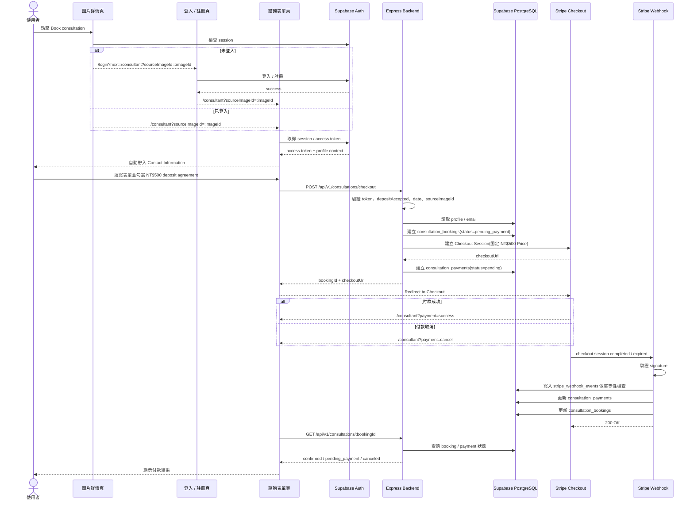

# 顧問預約與金流技術規格設計書

> 日期：2026-06-27  
> 狀態：Planned  
> 關聯文件：
> - 系統架構：[Asterism 後端架構規劃](./asterism-backend-architecture.md)
> - 選型決策：[顧問預約金流整合決策](./consultation-payment-provider-decision.md)

本文件定義顧問預約與 Stripe Checkout 的最小技術規格。此規格以「登入後建立預約，再建立固定 NT$500 訂金 Checkout Session」為主線。

---

## 1. 前端表單與後端 Payload

### 1.1 前端表單欄位

前端預計顯示：

| 顯示區塊 | 說明 | 是否送給後端 |
|---|---|---|
| Consultation Method | 諮詢方式 | yes |
| Date | 諮詢日期 | yes |
| Time Slot | 諮詢時段 | yes |
| Design Field | 設計領域 | yes |
| Design Focus | 設計重點 | yes |
| Contact Information | 由登入後 profile / auth 自動帶入 | no |
| Additional Notes | 自由輸入備註 | yes |
| Consultation Fee | 固定 NT$500 deposit | no，金額由後端控制 |
| Payment Agreement | `I understand and agree to continue to payment.` | yes，只送布林確認 |

`Contact Information` 不作為預約表單的可信 payload。表單送出前必須先完成登入，因此後端應從 Supabase Access Token 取得使用者，再讀取 `profiles` / Auth user email 產生聯絡資訊快照。

### 1.2 Submit Payload

前端送出到後端的 payload 建議如下：

```ts
type ConsultationMethod = 'online' | 'in-person'
type TimeSlot = 'am' | 'pm'

interface CreateConsultationCheckoutPayload {
  method: ConsultationMethod
  date: string
  timeSlot: TimeSlot
  designField?: string
  designFocus?: string
  sourceImageId?: string
  notes?: string
  depositAccepted: true
}
```

不送：

- `name`
- `email`
- `amount`
- `currency`
- Stripe price / product id

### 1.3 欄位對齊

| 前端 payload | 後端資料庫欄位 | 說明與轉換規則 |
|---|---|---|
| `method` | `method` | `in-person` 落庫時正規化為 `in_person` |
| `date` | `consultation_date` | 後端轉為標準 `date` |
| `timeSlot` | `time_slot` | 目前採半日時段：`am` / `pm` |
| `designField` | `design_field` | Nullable |
| `designFocus` | `design_focus` | Nullable |
| `sourceImageId` | `source_image_id` | Nullable，從 `/consultant?sourceImageId=:imageId` 帶入 |
| `notes` | `notes` | Nullable |
| `depositAccepted` | `deposit_accepted_at` | 必須為 `true`，後端落庫為 timestamp |
| access token | `profile_id` | 後端由 Supabase token 解析 |
| profile / auth | `contact_name`、`contact_email` | 後端產生當下快照，不信任前端輸入 |

### 1.4 金額與方案

- Stripe 只有一項商品 / Price：NT$500 consultation deposit。
- 前端只顯示金額，不送金額。
- 後端透過環境變數保存 Stripe Price ID，例如 `STRIPE_CONSULTATION_PRICE_ID`。
- DB 可記錄本次 checkout 的 `amount`、`currency`、`stripe_price_id`，但值必須由後端設定或 Stripe 回傳，不可由前端決定。
- Demo 文案：`For demo purposes only. No real payment will be charged.`

---

## 2. Auth 與入口規則

建立 consultation booking 前必須登入。後端不接受匿名 booking，也不接受前端傳入的 `name` / `email` 作為可信聯絡資料。

| 規則 | 說明 |
|---|---|
| 未登入入口 | 從圖片詳情點擊 `Book consultation` 時，前端導向 `/login?next=/consultant?sourceImageId=:imageId` |
| 登入後返回 | 登入 / 註冊成功後回到 `/consultant?sourceImageId=:imageId` |
| 已登入入口 | 直接進入 `/consultant?sourceImageId=:imageId` |
| 身分來源 | 後端由 Supabase Access Token 取得 `profile_id` |
| 聯絡資料 | 後端從 `profiles` / Auth user email 產生 `contact_name`、`contact_email` 快照 |
| 來源圖片 | 前端從 query 取得 `sourceImageId`，送出後由後端存為 `source_image_id` |
| 付款結果 | Stripe success / cancel 回到 `/consultant?payment=success` 或 `/consultant?payment=cancel` |

---

## 3. 後端檔案結構建議

本專案後端採用 Express + Prisma + Supabase PostgreSQL。金流與預約模組的最小新增檔案結構如下：

```text
backend-repo/
├─ src/
│  ├─ app.ts
│  ├─ config/
│  │  └─ env.ts
│  ├─ db/
│  │  └─ prisma.ts
│  ├─ modules/
│  │  ├─ consultations/
│  │  │  ├─ consultation.routes.ts
│  │  │  ├─ consultation.service.ts
│  │  │  └─ consultation.types.ts
│  │  └─ payments/
│  │     ├─ stripe.routes.ts
│  │     ├─ stripe.service.ts
│  │     ├─ stripe.webhook.ts
│  │     ├─ stripe.types.ts
│  │     └─ stripeWebhookEvent.service.ts
│  └─ middleware/
│     ├─ requireAuth.ts
│     └─ errorHandler.ts
└─ prisma/
   ├─ consultation.prisma
   └─ migrations/
```

### Stripe Webhook Raw Body

Stripe Webhook 驗證簽章需要原始請求主體，因此 webhook route 必須掛在 `express.json()` 之前：

```ts
app.post(
  '/api/v1/payments/stripe/webhook',
  express.raw({ type: 'application/json' }),
  stripeWebhookHandler
)

app.use(express.json())

app.use('/api/v1/consultations', requireAuth, consultationRoutes)
```

---

## 4. 資料庫 Schema 設計

### 4.1 `consultation_bookings`

| 欄位 | 型別 | 說明 |
|---|---|---|
| `id` | `uuid` | Primary Key |
| `profile_id` | `uuid` | references `profiles.id` |
| `source_image_id` | `text` | references `images.id`, Nullable |
| `method` | `text` | `online` / `in_person` |
| `consultation_date` | `date` | 預約日期 |
| `time_slot` | `text` | `am` / `pm` |
| `timezone` | `text` | 預設 `Asia/Taipei` |
| `design_field` | `text` | Nullable |
| `design_focus` | `text` | Nullable |
| `contact_name` | `text` | 後端由 profile 產生的快照，Nullable |
| `contact_email` | `text` | 後端由 Auth user email 產生的快照 |
| `notes` | `text` | Nullable |
| `deposit_accepted_at` | `timestamptz` | 使用者同意 NT$500 deposit 的時間 |
| `status` | `text` | `pending_payment` / `confirmed` / `payment_failed` / `canceled` / `completed` |
| `created_at` | `timestamptz` | 建立時間 |
| `updated_at` | `timestamptz` | 更新時間 |

### 4.2 `consultation_payments`

| 欄位 | 型別 | 說明 |
|---|---|---|
| `id` | `uuid` | Primary Key |
| `booking_id` | `uuid` | references `consultation_bookings.id`, Unique |
| `provider` | `text` | 預設 `stripe` |
| `stripe_price_id` | `text` | 固定 NT$500 deposit 的 Stripe Price ID |
| `provider_checkout_session_id` | `text` | Stripe Checkout Session ID，Unique |
| `provider_payment_intent_id` | `text` | Stripe Payment Intent ID，Unique, Nullable |
| `amount` | `integer` | 後端紀錄的本次收款金額 |
| `currency` | `text` | 預設 `TWD` |
| `status` | `text` | `pending` / `paid` / `failed` / `canceled` / `refunded` |
| `checkout_expires_at` | `timestamptz` | Nullable |
| `paid_at` | `timestamptz` | Nullable |
| `created_at` | `timestamptz` | 建立時間 |
| `updated_at` | `timestamptz` | 更新時間 |

### 4.3 `stripe_webhook_events`

| 欄位 | 型別 | 說明 |
|---|---|---|
| `id` | `uuid` | Primary Key |
| `stripe_event_id` | `text` | Stripe event id，Unique |
| `event_type` | `text` | 例如 `checkout.session.completed` |
| `payload` | `jsonb` | 原始事件 payload |
| `processed_at` | `timestamptz` | Nullable |
| `created_at` | `timestamptz` | 建立時間 |

### 4.4 DB Constraints

```sql
ALTER TABLE consultation_bookings
  ADD CONSTRAINT chk_consultation_method CHECK (method IN ('online', 'in_person')),
  ADD CONSTRAINT chk_consultation_time_slot CHECK (time_slot IN ('am', 'pm')),
  ADD CONSTRAINT chk_consultation_status CHECK (status IN ('pending_payment', 'confirmed', 'payment_failed', 'canceled', 'completed')),
  ADD CONSTRAINT chk_consultation_deposit_accepted CHECK (deposit_accepted_at IS NOT NULL);

ALTER TABLE consultation_payments
  ADD CONSTRAINT chk_consultation_payment_provider CHECK (provider IN ('stripe')),
  ADD CONSTRAINT chk_consultation_payment_status CHECK (status IN ('pending', 'paid', 'failed', 'canceled', 'refunded')),
  ADD CONSTRAINT chk_consultation_payment_amount CHECK (amount > 0);
```

---

## 5. API 設計

### 5.1 建立預約並取得 Checkout URL

```text
POST /api/v1/consultations/checkout
Authorization: Bearer <supabase_access_token>
```

Request body:

```json
{
  "method": "online",
  "date": "2026-07-01",
  "timeSlot": "am",
  "designField": "Styling design",
  "designFocus": "Material palette",
  "sourceImageId": "image_123",
  "notes": "I want advice for a calm living room.",
  "depositAccepted": true
}
```

Response:

```json
{
  "success": true,
  "data": {
    "bookingId": "uuid",
    "checkoutUrl": "https://checkout.stripe.com/..."
  },
  "error": null
}
```

驗證規則：

- 未登入：回傳 `401`，前端導向 `/login?next=/consultant?sourceImageId=:imageId`。
- `depositAccepted !== true`：回傳 `400`，不得建立 booking。
- 後端從 token 解析 `profile_id`。
- 後端讀取 profile / auth user email，寫入 `contact_name`、`contact_email` 快照。
- 後端使用固定 `STRIPE_CONSULTATION_PRICE_ID` 建立 Checkout Session。

### 5.2 查詢預約狀態

```text
GET /api/v1/consultations/:bookingId
Authorization: Bearer <supabase_access_token>
```

用途：前端在 `/consultant?payment=success` 或 `/consultant?payment=cancel` 後查詢最新狀態。

### 5.3 Stripe Webhook

```text
POST /api/v1/payments/stripe/webhook
```

用途：

- 驗證 Stripe signature。
- 透過 `stripe_webhook_events` 做冪等性控制。
- 處理 `checkout.session.completed`。
- 處理 `checkout.session.expired`。

---

## 6. 狀態機

| 情境 | `consultation_bookings.status` | `consultation_payments.status` | 說明 |
|---|---|---|---|
| 初始化建立 | `pending_payment` | `pending` | booking 與 Checkout Session 建立完成 |
| 付款成功 | `confirmed` | `paid` | Webhook 確認付款完成 |
| 付款失敗 | `payment_failed` | `failed` | 付款失敗事件 |
| 取消 / 逾期 | `canceled` | `canceled` | 使用者取消或 Checkout Session 過期 |
| 退款 | `canceled` | `refunded` | 管理員於 Stripe 後台退款 |
| 服務完成 | `completed` | `paid` | 顧問服務完成 |

---

## 7. 功能流程圖



---

## 8. 最小落地順序

1. **Prisma Migration**
   - 新增 `consultation_bookings`
   - 新增 `consultation_payments`
   - 新增 `stripe_webhook_events`
   - 補上必要 DB constraints
2. **Auth middleware**
   - 實作 `requireAuth.ts`
   - 後端由 Supabase Access Token 取得 `profile_id`
3. **Checkout API**
   - 實作 `POST /api/v1/consultations/checkout`
   - 驗證 `depositAccepted`
   - 由後端帶入 contact snapshot 與 Stripe Price ID
4. **Webhook**
   - 實作 raw body 驗簽
   - 實作 webhook event 冪等性
   - 處理 completed / expired
5. **Status API**
   - 實作 `GET /api/v1/consultations/:bookingId`
6. **Frontend**
   - 未登入導向 login next flow
   - 已登入自動帶入 profile
   - 成功 / 取消回到 `/consultant?payment=success|cancel`
