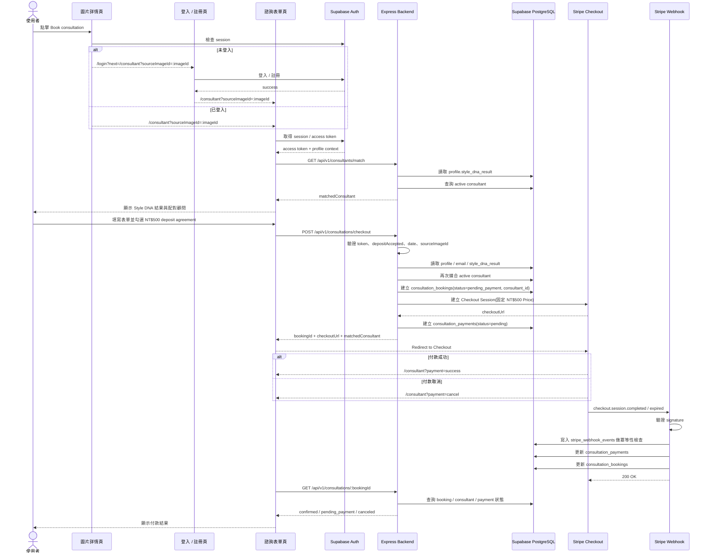

# 顧問預約與金流技術規格設計書

> 更新日期：2026-06-28
> 狀態：Planned
> 版本：v2 - 新增 Consultant schema、顧問媒合流程與 booking 關聯與顧問媒合邏輯規格
> 關聯文件：
> - 系統架構：[Asterism 後端架構規劃](./asterism-backend-architecture.md)
> - 選型決策：[顧問預約金流整合決策](./consultation-payment-provider-decision.md)
> - 顧問媒合邏輯：[顧問媒合邏輯技術規格](./consultant-matching-spec.md)

本文件定義顧問預約與 Stripe Checkout 的最小技術規格。此規格以「登入後建立預約、後端媒合顧問，再建立固定 NT$500 訂金 Checkout Session」為主線。

---

## 0. 本次規格變更摘要

本版保留顧問媒合所需資料模型與 API 串接位置，並將顧問媒合判斷邏輯拆分至獨立文件，避免金流規格書同時承擔演算法規格。

### 新增內容

- 新增 `consultants` table。
- `consultation_bookings` 新增 `consultant_id` nullable relation。
- 新增 `GET /api/v1/consultants/match`。
- `POST /api/v1/consultations/checkout` 建立 booking 前，後端需再次媒合 active consultant。
- 顧問媒合細節請見：[顧問媒合邏輯技術規格](./consultant-matching-spec.md)。
- 功能流程圖補上顧問媒合與 `consultant_id` 寫入 booking。

### 設計原則

- `profiles.style_dna_result` 只保存 Style DNA 結果摘要，不保存 consultant 顯示文字或媒合結果。
- `Consultant` 是獨立業務實體，不能塞進 JSON 欄位。
- 前端可顯示 matched consultant，但不得作為可信資料來源。
- 建立預約與金流流程必須走 Express Backend，不直接由前端 insert booking。
- MVP 階段不實作完整推薦演算法、顧問排班、負載分配或 9 大 style group 對 9 位顧問的完整系統；詳細排除項目由顧問媒合邏輯文件維護。

---

## 1. 前端表單與後端 Payload

### 1.1 前端表單欄位

前端預計顯示：

| 顯示區塊 | 說明 | 是否送給後端 |
|---|---|---|
| Matched Consultant | 後端媒合結果，前端只顯示 | no |
| Style DNA Result | 由登入後 profile 帶入，用於說明媒合依據 | no |
| Consultation Method | 諮詢方式 | yes |
| Date | 諮詢日期 | yes |
| Time Slot | 諮詢時段 | yes |
| Design Field | 設計領域 | yes |
| Design Focus | 設計重點 | yes |
| Contact Information | 由登入後 profile / auth 自動帶入 | no |
| Additional Notes | 自由輸入備註 | yes |
| Consultation Fee | 固定 NT$500 deposit | no，金額由後端控制 |
| Payment Agreement | `I understand and agree to continue to payment.` | yes，只送布林確認 |

`Contact Information` 不作為預約表單的可信 payload。表單送出前必須先完成登入，因此後端應從 Supabase Access Token 取得使用者，再讀取 `profiles` / Auth user email 產生聯絡資訊快照。

`Matched Consultant` 由後端 API 回傳給前端顯示。前端送出 checkout payload 時不得傳入 `consultantId`，避免使用者竄改 request body 指定顧問。

### 1.2 Submit Payload

前端送出到後端的 payload 建議如下：

```ts
type ConsultationMethod = 'online' | 'in-person'
type TimeSlot = 'am' | 'pm'

interface CreateConsultationCheckoutPayload {
  method: ConsultationMethod
  date: string
  timeSlot: TimeSlot
  designField?: string
  designFocus?: string
  sourceImageId?: string
  notes?: string
  depositAccepted: true
}
```

不送：

- `name`
- `email`
- `amount`
- `currency`
- `consultantId`
- `consultantName`
- `consultantTitle`
- Stripe price / product id

### 1.3 欄位對齊

| 前端 payload / 來源 | 後端資料庫欄位 | 說明與轉換規則 |
|---|---|---|
| `method` | `method` | `in-person` 落庫時正規化為 `in_person` |
| `date` | `consultation_date` | 後端轉為標準 `date` |
| `timeSlot` | `time_slot` | 目前採半日時段：`am` / `pm` |
| `designField` | `design_field` | Nullable |
| `designFocus` | `design_focus` | Nullable |
| `sourceImageId` | `source_image_id` | Nullable，從 `/consultant?sourceImageId=:imageId` 帶入 |
| `notes` | `notes` | Nullable |
| `paymentConsentAcceptedAt` | `payment_consent_accepted_at` | 必須為 `true`，後端落庫為 timestamp |
| access token | `profile_id` | 後端由 Supabase token 解析 |
| profile / auth | `contact_name`、`contact_email` | 後端產生當下快照，不信任前端輸入 |
| profile `style_dna_result` | `consultant_id` | 後端媒合 active consultant 後寫入 |

### 1.4 金額與方案

- Stripe 只有一項商品 / Price：NT$500 consultation deposit。
- 前端只顯示金額，不送金額。
- 後端透過環境變數保存 Stripe Price ID，例如 `STRIPE_CONSULTATION_PRICE_ID`。
- DB 可記錄本次 checkout 的 `amount`、`currency`、`stripe_price_id`，但值必須由後端設定或 Stripe 回傳，不可由前端決定。
- Demo 文案：`For demo purposes only. No real payment will be charged.`

---

## 2. Auth 與入口規則

建立 consultation booking 前必須登入。後端不接受匿名 booking，也不接受前端傳入的 `name` / `email` / `consultantId` 作為可信資料。

| 規則 | 說明 |
|---|---|
| 未登入入口 | 從圖片詳情點擊 `Book consultation` 時，前端導向 `/login?next=/consultant?sourceImageId=:imageId` |
| 登入後返回 | 登入 / 註冊成功後回到 `/consultant?sourceImageId=:imageId` |
| 已登入入口 | 直接進入 `/consultant?sourceImageId=:imageId` |
| 身分來源 | 後端由 Supabase Access Token 取得 `profile_id` |
| Style DNA 來源 | 後端從 `profiles.style_dna_result` 取得媒合依據 |
| 顧問媒合 | 後端依 Style DNA 結果媒合 active consultant |
| 聯絡資料 | 後端從 `profiles` / Auth user email 產生 `contact_name`、`contact_email` 快照 |
| 來源圖片 | 前端從 query 取得 `sourceImageId`，送出後由後端存為 `source_image_id` |
| 付款結果 | Stripe success / cancel 回到 `/consultant?payment=success` 或 `/consultant?payment=cancel` |

---

## 3. 金流與預約模組檔案結構

完整 Backend Repo 目標結構與 route、validation、service 的共通責任，統一由 [Asterism 後端架構規劃](./asterism-backend-architecture.md#31-backend-repo-目標檔案結構) 維護。

本文件只列出顧問預約與 Stripe 金流流程直接負責的模組。顧問媒合屬於 `consultants` 模組，由 [顧問媒合邏輯技術規格](./consultant-matching-spec.md) 維護；`consultation.service.ts` 在建立 booking 前呼叫該模組提供的媒合流程。

```text
backend-repo/
├─ src/
│  ├─ modules/
│  │  ├─ consultations/
│  │  │  ├─ consultation.routes.ts
│  │  │  ├─ consultation.service.ts
│  │  │  ├─ consultation.validation.ts
│  │  │  └─ consultation.types.ts
│  │  └─ payments/
│  │     ├─ stripe.routes.ts
│  │     ├─ stripe.service.ts
│  │     ├─ stripe.webhook.ts
│  │     ├─ stripe.types.ts
│  │     └─ stripe-webhook-event.service.ts
│  └─ middleware/
│     ├─ requireAuth.ts
│     ├─ validateRequest.ts
│     └─ errorHandler.ts
└─ prisma/
   ├─ consultation.prisma
   └─ migrations/
```

### Stripe Webhook Raw Body

Stripe Webhook 驗證簽章需要原始請求主體，因此 webhook route 必須掛在 `express.json()` 之前：

```ts
app.post(
  '/api/v1/payments/stripe/webhook',
  express.raw({ type: 'application/json' }),
  stripeWebhookHandler
)

app.use(express.json())

app.use('/api/v1/consultants', requireAuth, consultantRoutes)
app.use('/api/v1/consultations', requireAuth, consultationRoutes)
```

---

## 4. 資料庫 Schema 設計

### 4.1 `consultants`

顧問為獨立業務實體，用於顧問媒合、預約紀錄與未來後台管理。MVP 階段先建立少量 seed data，不實作完整排班與負載分配。

| 欄位 | 型別 | 說明 |
|---|---|---|
| `id` | `uuid` | Primary Key |
| `display_name` | `varchar(80)` | 顧問顯示名稱 |
| `title` | `varchar(80)` | 顧問職稱，例如 `Spatial Consultant` |
| `avatar_url` | `text` | Nullable，顧問頭像 |
| `bio` | `text` | Nullable，顧問簡介 |
| `specialty` | `text` | Nullable，MVP 媒合用分類，例如 `spatial` / `visual_styling` / `concept_design` |
| `is_active` | `boolean` | 是否可被媒合 |
| `created_at` | `timestamptz` | 建立時間 |
| `updated_at` | `timestamptz` | 更新時間 |

Prisma model 建議：

```prisma
model Consultant {
  id          String   @id @default(uuid()) @db.Uuid
  displayName String   @map("display_name") @db.VarChar(80)
  title       String   @db.VarChar(80)
  avatarUrl   String?  @map("avatar_url") @db.Text
  bio         String?  @db.Text
  specialty   String?  @db.Text
  isActive    Boolean  @default(true) @map("is_active")
  createdAt   DateTime @default(now()) @map("created_at") @db.Timestamptz(6)
  updatedAt   DateTime @updatedAt @map("updated_at") @db.Timestamptz(6)

  consultationBookings ConsultationBooking[]

  @@index([specialty])
  @@index([isActive])
  @@map("consultants")
}
```

### 4.2 `consultation_bookings`

| 欄位 | 型別 | 說明 |
|---|---|---|
| `id` | `uuid` | Primary Key |
| `profile_id` | `uuid` | references `profiles.id` |
| `consultant_id` | `uuid` | references `consultants.id`, Nullable |
| `source_image_id` | `text` | references `images.id`, Nullable |
| `method` | `text` | `online` / `in_person` |
| `consultation_date` | `date` | 預約日期 |
| `time_slot` | `text` | `am` / `pm` |
| ~~`timezone`~~ | ~~`text`~~ | ~~預設 `Asia/Taipei`~~ |
| `design_field` | `text` | Nullable |
| `design_focus` | `text` | Nullable |
| `contact_name` | `text` | 後端由 profile 產生的快照，Nullable |
| `contact_email` | `text` | 後端由 Auth user email 產生的快照 |
| `notes` | `text` | Nullable |
| `payment_consent_accepted_at` | `timestamptz` | 使用者同意 NT$500 deposit 的時間 |
| `status` | `text` | `pending_payment` / `confirmed` / `payment_failed` / `canceled` / `completed` |
| `created_at` | `timestamptz` | 建立時間 |
| `updated_at` | `timestamptz` | 更新時間 |

`consultant_id` 代表本次預約實際媒合到的顧問。若顧問資料未來被停用或刪除，歷史 booking 不應被刪除，因此 relation 建議使用 `onDelete: SetNull`。

Prisma relation 建議：

```prisma
consultantId String? @map("consultant_id") @db.Uuid
consultant   Consultant? @relation(
  fields: [consultantId],
  references: [id],
  onDelete: SetNull
)

@@index([consultantId])
```

### 4.3 `consultation_payments`

| 欄位 | 型別 | 說明 |
|---|---|---|
| `id` | `uuid` | Primary Key |
| `booking_id` | `uuid` | references `consultation_bookings.id`, Unique |
| `provider` | `text` | 預設 `stripe` |
| `stripe_price_id` | `text` | 固定 NT$500 deposit 的 Stripe Price ID |
| `provider_checkout_session_id` | `text` | Stripe Checkout Session ID，Unique |
| `provider_payment_intent_id` | `text` | Stripe Payment Intent ID，Unique, Nullable |
| `amount` | `integer` | 後端紀錄的本次收款金額 |
| `currency` | `varchar(3)` | 預設 `TWD`，MVP 僅支援 TWD |
| `status` | `text` | `pending` / `paid` / `failed` / `canceled` / `refunded` |
| `checkout_expires_at` | `timestamptz` | Nullable |
| `paid_at` | `timestamptz` | Nullable |
| `refunded_at` | `timestamptz` | Nullable，退款完成時間 |
| `provider_refund_id` | `text` | Stripe Refund ID，Unique, Nullable |
| `failed_at` | `timestamptz` | Nullable，付款失敗時間 |
| `canceled_at` | `timestamptz` | Nullable，付款取消時間 |
| `failure_reason` | `text` | Nullable，付款失敗原因 |
| `created_at` | `timestamptz` | 建立時間 |
| `updated_at` | `timestamptz` | 更新時間 |

### 4.4 `stripe_webhook_events`

| 欄位 | 型別 | 說明 |
|---|---|---|
| `id` | `uuid` | Primary Key |
| `stripe_event_id` | `text` | Stripe event id，Unique |
| `event_type` | `text` | 例如 `checkout.session.completed` |
| `payload` | `jsonb` | 原始事件 payload |
| `processed_at` | `timestamptz` | Nullable，處理時間 |
| `processing_error` | `text` | Nullable，處理失敗原因 |
| `created_at` | `timestamptz` | 建立時間 |

### 4.5 DB Constraints

```sql
ALTER TABLE consultation_bookings
  ADD CONSTRAINT chk_consultation_method CHECK (method IN ('online', 'in_person')),
  ADD CONSTRAINT chk_consultation_time_slot CHECK (time_slot IN ('am', 'pm')),
  ADD CONSTRAINT chk_consultation_status CHECK (status IN ('pending_payment', 'confirmed', 'payment_failed', 'canceled', 'completed')),
  ADD CONSTRAINT chk_consultation_deposit_accepted CHECK (payment_consent_accepted_at IS NOT NULL);

ALTER TABLE consultation_payments
  ADD CONSTRAINT chk_consultation_payment_provider CHECK (provider IN ('stripe')),
  ADD CONSTRAINT chk_consultation_payment_status CHECK (status IN ('pending', 'paid', 'failed', 'canceled', 'refunded')),
  ADD CONSTRAINT chk_consultation_payment_amount CHECK (amount > 0);
```

### 4.6 Supabase Auto API 使用界線

Schema 推到 Supabase 後，前端可視需求透過 Supabase Auto API 讀取公開或使用者自己的資料，但以下規則必須遵守：

| 資料 / 功能 | Supabase Auto API | Express Backend | 說明 |
|---|---:|---:|---|
| 讀取 active consultants 公開資料 | 可以 | 可以 | 僅限 `is_active = true` 且欄位為公開顯示資訊 |
| 顧問媒合 | 不建議 | 必須 | 需讀取 profile、解析 Style DNA、套用 fallback |
| 建立 consultation booking | 不建議 | 必須 | 需同時處理顧問媒合、contact snapshot、付款狀態 |
| 建立 Stripe Checkout Session | 不可 | 必須 | 需要 Stripe secret key |
| Stripe webhook | 不可 | 必須 | 需要 raw body 與 signature verification |
| 更新 payment status | 不可 | 必須 | 只能由 backend / webhook 控制 |

RLS 建議：

- `consultants`：允許前端讀取 `is_active = true` 的公開欄位；禁止一般使用者 insert / update / delete。
- `consultation_bookings`：使用者只能讀取自己的 booking；不得由前端直接 insert payment-related booking。
- `consultation_payments`：使用者只能讀取自己的 payment 狀態；不得由前端 insert / update。
- `stripe_webhook_events`：不開放前端存取。

---

## 5. 顧問媒合邏輯引用

- [顧問媒合邏輯技術規格](./consultant-matching-spec.md)

本文件只保留顧問媒合在預約與金流流程中的使用位置：

- 顧問諮詢頁載入時，前端呼叫 `GET /api/v1/consultants/match` 顯示 matched consultant。
- 建立 checkout booking 前，後端必須再次執行顧問媒合，並將結果寫入 `consultation_bookings.consultant_id`。
- 前端不得在 checkout payload 中傳入 `consultantId`、`consultantName` 或 `consultantTitle`。


## 6. API 設計

### 6.1 查詢媒合顧問

```text
GET /api/v1/consultants/match
Authorization: Bearer <supabase_access_token>
```

用途：顧問諮詢頁載入時，顯示目前登入使用者的 matched consultant。媒合判斷細節請見：[顧問媒合邏輯技術規格](./consultant-matching-spec.md)。

Response:

```json
{
  "success": true,
  "data": {
    "matchedConsultant": {
      "id": "uuid",
      "displayName": "Mira Chen",
      "title": "Spatial Consultant",
      "avatarUrl": "/images/consultants/mira.webp",
      "bio": "Specializes in translating visual preferences into spatial direction."
    },
    "matchReason": {
      "source": "style_dna_result",
      "matchedStyleGroup": "minimal",
      "matchedSpecialty": "spatial"
    }
  },
  "error": null
}
```

錯誤情境：

- 未登入：回傳 `401`。
- 找不到 profile：回傳 `404 PROFILE_NOT_FOUND`。
- 無 active consultant：回傳 `409 CONSULTANT_UNAVAILABLE`。

### 6.2 建立預約並取得 Checkout URL

```text
POST /api/v1/consultations/checkout
Authorization: Bearer <supabase_access_token>
```

Request body:

```json
{
  "method": "online",
  "date": "2026-07-01",
  "timeSlot": "am",
  "designField": "Styling design",
  "designFocus": "Material palette",
  "sourceImageId": "image_123",
  "notes": "I want advice for a calm living room.",
  "depositAccepted": true
}
```

Response:

```json
{
  "success": true,
  "data": {
    "bookingId": "uuid",
    "checkoutUrl": "https://checkout.stripe.com/...",
    "matchedConsultant": {
      "id": "uuid",
      "displayName": "Mira Chen",
      "title": "Spatial Consultant"
    }
  },
  "error": null
}
```

輸入驗證與業務規則：

- `requireAuth` 驗證登入狀態；未登入時回傳 `401`，前端導向 `/login?next=/consultant?sourceImageId=:imageId`。
- `validateRequest` 依 `consultation.validation.ts` 驗證 request body 的必填欄位、型別、日期格式與 `depositAccepted === true`；失敗時回傳 `400`，不得進入 service 或建立 booking。
- 後端從 token 解析 `profile_id`。
- 後端讀取 profile / auth user email，寫入 `contact_name`、`contact_email` 快照。
- 後端建立 booking 前需執行 consultant match；媒合細節請見：[顧問媒合邏輯技術規格](./consultant-matching-spec.md)。
- 若找不到符合 style group 的 consultant，fallback 為第一位 `is_active = true` 的 consultant。
- 若完全沒有 active consultant，回傳 `409 CONSULTANT_UNAVAILABLE`，不得建立 checkout session。
- 後端使用固定 `STRIPE_CONSULTATION_PRICE_ID` 建立 Checkout Session。
- 前端不得傳入 `consultantId`、金額、幣別或 Stripe price id。

### 6.3 查詢預約狀態

```text
GET /api/v1/consultations/:bookingId
Authorization: Bearer <supabase_access_token>
```

用途：前端在 `/consultant?payment=success` 或 `/consultant?payment=cancel` 後查詢最新狀態。

Response 應包含 booking、payment 與 consultant 顯示資料：

```json
{
  "success": true,
  "data": {
    "booking": {
      "id": "uuid",
      "status": "confirmed",
      "consultationDate": "2026-07-01",
      "timeSlot": "am"
    },
    "payment": {
      "status": "paid",
      "amount": 500,
      "currency": "TWD"
    },
    "consultant": {
      "id": "uuid",
      "displayName": "Mira Chen",
      "title": "Spatial Consultant"
    }
  },
  "error": null
}
```

### 6.4 Stripe Webhook

```text
POST /api/v1/payments/stripe/webhook
```

用途：

- 驗證 Stripe signature。
- 透過 `stripe_webhook_events` 做冪等性控制。
- 處理 `checkout.session.completed`。
- 處理 `checkout.session.expired`。

---

## 7. 狀態機

| 情境 | `consultation_bookings.status` | `consultation_payments.status` | 說明 |
|---|---|---|---|
| 初始化建立 | `pending_payment` | `pending` | booking 已建立並寫入 `consultant_id`，Checkout Session 建立完成 |
| 付款成功 | `confirmed` | `paid` | Webhook 確認付款完成 |
| 付款失敗 | `payment_failed` | `failed` | 付款失敗事件 |
| 取消 / 逾期 | `canceled` | `canceled` | 使用者取消或 Checkout Session 過期 |
| 退款 | `canceled` | `refunded` | 管理員於 Stripe 後台退款 |
| 服務完成 | `completed` | `paid` | 顧問服務完成 |

---

## 8. 功能流程圖



---

## 9. 最小落地順序

1. **Prisma Migration**
   - 新增 `consultants`
   - `consultation_bookings` 補上 `consultant_id`
   - 新增 `consultation_payments`
   - 新增 `stripe_webhook_events`
   - 補上必要 DB constraints
2. **Consultant Seed**
   - 新增 1～3 位 MVP consultant
   - 至少保留一位 `is_active = true`
3. **HTTP middleware**
   - 實作 `requireAuth.ts`
   - 實作共用 `validateRequest.ts`
   - 後端由 Supabase Access Token 取得 `profile_id`
4. **Consultant Match API**
   - 實作 `GET /api/v1/consultants/match`
   - 根據 [顧問媒合邏輯技術規格](./consultant-matching-spec.md) 實作 rule-based matching
5. **Checkout API**
   - 實作 `POST /api/v1/consultations/checkout`
   - 驗證 `depositAccepted`
   - 後端再次媒合 consultant
   - 建立 booking 時寫入 `consultant_id`
   - 由後端帶入 contact snapshot 與 Stripe Price ID
6. **Webhook**
   - 實作 raw body 驗簽
   - 實作 webhook event 冪等性
   - 處理 completed / expired
7. **Status API**
   - 實作 `GET /api/v1/consultations/:bookingId`
   - 回傳 booking / consultant / payment 狀態
8. **Frontend**
   - 未登入導向 login next flow
   - 顧問頁讀取 `GET /api/v1/consultants/match`
   - 已登入自動帶入 profile / Style DNA context
   - 顯示 matched consultant
   - 成功 / 取消回到 `/consultant?payment=success|cancel`
   - checkout 後查詢 booking 狀態
